# Documentação IoTDoc - Módulo 4 - Inteli

## IPTrack

#### Integrantes do grupo
- <a href="https://www.linkedin.com/in/ana-beggiato/">Ana Beggiato</a>
- <a href="https://www.linkedin.com/in/eduardo-rizk/">Eduardo Rizk </a>
- <a href="https://www.linkedin.com/in/igor-sampaio-silva/">Igor Sampaio Silva </a> 
- <a href="https://www.linkedin.com/in/larissa-martins-304644245/">Larissa Martins </a> 
- <a href="https://www.linkedin.com/in/pedro-haouli/">Pedro Haouli</a>
- <a href="https://www.linkedin.com/in/raphaelfelipesilva/">Raphael Felipe Silva</a> 
- <a href="https://www.linkedin.com/in/ryan-botelho-gartlan/">Ryan Botelho Gartlan</a>

## Sumário

[1. Introdução](#1-introdução)

- [1.1. Objetivos](#11-objetivos)
  - [1.1.1. Objetivo Geral](#111-objetivo-geral)
  - [1.1.2. Objetivos Específicos](#112-objetivos-específicos)
- [1.2. Proposta da Solução](#12-proposta-da-solução)
- [1.3. Justificativa](#13-justificativa)

[2. Metodologia](#2-metodologia)

[3. Desenvolvimento e Resultados](#3-desenvolvimento-e-resultados)

- [3.1. Domínio de Fundamentos de Negócio](#31-domínio-de-fundamentos-de-negócio)
  - [3.1.1. Contexto da Indústria](#311-contexto-da-indústria)
    - [3.1.1.1. Forças de Porter](#3111-forças-de-porter)
  - [3.1.2. Análise SWOT](#312-análise-swot)
  - [3.1.3. Descrição da Solução a ser Desenvolvida](#313-descrição-da-solução-a-ser-desenvolvida)
    - [3.1.3.1. Qual é o problema a ser resolvido](#3131-qual-é-o-problema-a-ser-resolvido)
    - [3.1.3.2. Qual a solução proposta (visão de negócios)](#3132-qual-a-solução-proposta-visão-de-negócios)
    - [3.1.3.3. Como a solução proposta deverá ser utilizada](#3133-como-a-solução-proposta-deverá-ser-utilizada)
    - [3.1.3.4. Quais os benefícios trazidos pela solução proposta](#3134-quais-os-benefícios-trazidos-pela-solução-proposta)
    - [3.1.3.5. Qual será o critério de sucesso e qual medida será utilizada para o avaliar](#3135-qual-será-o-critério-de-sucesso-e-qual-medida-será-utilizada-para-o-avaliar)
  - [3.1.4. Value Proposition Canvas](#314-value-proposition-canvas)
  - [3.1.5. Matriz de Riscos](#315-matriz-de-riscos)
  - [3.1.6. Política de Privacidade de acordo com a LGPD](#316-política-de-privacidade-de-acordo-com-a-lgpd)
    - [3.1.6.1. Informações gerais sobre a empresa / organização](#3161-nformações-gerais-sobre-a-empresa-/-organização)
    - [3.1.6.1 Informações gerais sobre a empresa / organização](#3161-informações-gerais-sobre-a-empresa--organização)
    - [3.1.6.2 Informações sobre o tratamento de dados](#3162-informações-sobre-o-tratamento-de-dados)
    - [3.1.6.3 Quais são os dados coletados](#3163-quais-são-os-dados-coletados)
    - [3.1.6.4 Onde os dados são coletados](#3164-onde-os-dados-são-coletados)
    - [3.1.6.5 Para quais finalidades os dados serão utilizadas](#3165-para-quais-finalidades-os-dados-serão-utilizadas)
    - [3.1.6.6 Onde os dados ficam armazenados](#3166-onde-os-dados-ficam-armazenados)
    - [3.1.6.7 Qual o período de armazenamento dos dados (retenção)](#3167-qual-o-período-de-armazenamento-dos-dados-retenção)
    - [3.1.6.8 Uso de cookies e/ou tecnologias semelhantes](#3168-uso-de-cookies-eou-tecnologias-semelhantes)
    - [3.1.6.9 Com quem esses dados são compartilhados (parceiros, fornecedores, subcontratados)](#3169-com-quem-esses-dados-são-compartilhados-parceiros-fornecedores-subcontratados)
    - [3.1.6.10 Informações sobre medidas de segurança adotadas pela empresa](#31610-informações-sobre-medidas-de-segurança-adotadas-pela-empresa)
    - [3.1.6.11 Orientações sobre como a empresa/organização atende aos direitos dos usuários](#31611-orientações-sobre-como-a-empresaorganização-atende-aos-direitos-dos-usuários)
    - [3.1.6.12 Informações sobre como o titular de dados pode solicitar e exercer os seus direitos](#31612-informações-sobre-como-o-titular-de-dados-pode-solicitar-e-exercer-os-seus-direitos)
    - [3.1.6.13 Informações de contato do Data Protection Officer (DPO) ou encarregado de proteção de dados da organização](#31613-informações-de-contato-do-data-protection-officer-dpo-ou-encarregado-de-proteção-de-dados-da-organização)

  - [3.1.7. Bill of Material (BOM)](#317-bill-of-material-bom)
- [3.2. Domínio de Fundamentos de Experiência de Usuário](#32-domínio-de-fundamentos-de-experiência-de-usuário)
  - [3.2.1. Personas](#321-personas)
  - [3.2.2. Jornada do Usuário e Storyboard](#322-jornada-do-usuário-e-storyboard)
    - [3.2.2.1. Jornada do usuário](#3221-jornada-do-usuário)
    -[3.2.2.2. Storyboard](#3222-storyboard)
- [3.3. Solução Técnica](#33-solução-técnica)
  - [3.3.1. Requisitos Funcionais](#331-requisitos-funcionais)
  - [3.3.2. Requisitos Não Funcionais](#332-requisitos-não-funcionais)
  - [3.3.3. Arquitetura da Solução](#333-arquitetura-da-solução)
  - [3.3.4. Arquitetura do Protótipo](#334-arquitetura-do-protótipo)
  - [3.3.5. Arquitetura Refinada da Solução](#335-arquitetura-refinada-da-solução)
- [3.4. Resultados](#34-resultados)
  - [3.4.1.Protótipo Inicial do Projeto usando o Simulador Wokwi](#34-resultados)
  - [3.4.2. Protótipo Físico do Projeto (offline)](#341-protótipo-inicial-do-projeto-usando-o-simulador-wokwi)
  - [3.4.3. Protótipo do Projeto com MQTT e I2C](#342-protótipo-físico-do-projeto-offline)
  - [3.4.4. Protótipo Físico do Projeto (online)](#344-protótipo-físico-do-projeto-online)
  - [3.4.5. Protótipo Final do Projeto ](#345-considerações-finais)

[4. Conclusões e Recomendações](#4-conclusões-e-recomendações)

[5. Referências](#5-referências)

# 1. Introdução

&nbsp;&nbsp;&nbsp;&nbsp;O Instituto de Pesquisas Tecnológicas (IPT), fundado em 1899 e vinculado ao Governo do Estado de São Paulo, é uma das instituições mais renomadas na aplicação de soluções tecnológicas para o desenvolvimento nacional. Com uma infraestrutura laboratorial avançada e equipes multidisciplinares, o IPT atua em áreas como pesquisa e desenvolvimento, serviços tecnológicos, metrologia, e educação tecnológica. Dentro deste contexto de inovação, o IPT enfrenta desafios específicos no monitoramento de seus equipamentos de laboratório.

&nbsp;&nbsp;&nbsp;&nbsp;Atualmente, no Laboratório de Processos Metalúrgicos (LPM), há mais de 500 equipamentos que operam sob demanda, o que torna essencial a implementação de um sistema de monitoramento contínuo para garantir a manutenção adequada, aumentar a vida útil e reduzir custos operacionais. No entanto, esses equipamentos não possuem uma solução integrada de transmissão de dados, o que dificulta o acompanhamento em tempo real de variáveis essenciais para a operação.

&nbsp;&nbsp;&nbsp;&nbsp;Com o objetivo de solucionar este problema, o projeto visa desenvolver um dispositivo de IoT de baixo custo para monitorar as condições de funcionamento dos equipamentos, como temperatura e tempo de operação. Esse dispositivo permitirá o controle de manutenção preventiva, aumentando a eficiência operacional do laboratório e garantindo maior disponibilidade dos ativos.

## 1.1 Objetivos

&nbsp;&nbsp;&nbsp;&nbsp;Os objetivos do Instituto de Pesquisa Tecnológica (IPT) para este projeto de monitoramento de equipamentos de laboratório estão voltados para a otimização da gestão de seus recursos tecnológicos, com foco na eficiência operacional e redução de custos. Diante disso, os objetivos do projeto estão definidos da seguinte forma:

### 1.1.1. Objetivo Geral:

&nbsp;&nbsp;&nbsp;&nbsp;O objetivo principal do IPT é melhorar a gestão e manutenção de seus equipamentos de laboratório, utilizando uma solução de monitoramento contínuo que permita antecipar problemas e otimizar a operação dos ativos. A ideia é que, com isso, a instituição possa garantir maior vida útil dos equipamentos, reduzir custos e aumentar a disponibilidade para novos projetos e ensaios.

### 1.1.2. Objetivos Específicos:

- **Redução de Custos Operacionais:** Identificar, através do monitoramento, oportunidades para reduzir os custos de manutenção e operação dos equipamentos, minimizando gastos desnecessários.
- **Aumento da Vida Útil dos Equipamentos:** Garantir que os equipamentos operem em condições ideais por mais tempo, graças à manutenção preventiva baseada em dados gerados em tempo real.
- **Maximização da Disponibilidade dos Equipamentos:** Assegurar que os equipamentos estejam prontos para uso sempre que necessário, evitando falhas inesperadas ou períodos prolongados de inatividade.
- **Otimização dos Processos de Manutenção:** Fornecer informações detalhadas sobre o estado dos equipamentos, permitindo que a equipe de manutenção possa agir proativamente, ao invés de reagir a problemas já ocorridos. 
  &nbsp;&nbsp;&nbsp;&nbsp;Esses objetivos refletem as metas de eficiência, sustentabilidade e inovação que o IPT busca com o desenvolvimento deste projeto, sem considerar as especificações técnicas que serão aplicadas para alcançar tais metas.

## 1.2 Proposta da solução

&nbsp;&nbsp;&nbsp;&nbsp;Sabendo-se que a proposta de solução envolve a criação de um sistema integrado de monitoramento para equipamentos de laboratório do IPT, definiram-se os seguintes componentes da solução com base nos objetivos supracitados, tais como a coleta em tempo real de dados críticos sobre o estado dos equipamentos, prevenção de problemas e redução de custos com manutenção. Com isso, a fim de atendê-los, tem-se:

- **Sensores de Temperatura, Pressão e Vibração**: A instalação de sensores nos equipamentos permite a captação de dados em tempo real sobre as variáveis críticas de operação. Com isso, será possível monitorar o bom funcionamento dos equipamentos e identificar desvios dos padrões normais.

- **Alerta sonoro**: Com base na captação desses indicadores, caso algum ultrapasse os limites definidos, um alerta sonoro poderá ser ativado para notificar imediatamente a equipe técnica sobre o problema, permitindo uma ação rápida para prevenir falhas graves.

- **Visor de exibição**: Para exibir os valores de temperatura, pressão e vibração, será implementado um visor digital que oferece uma interface visual para facilitar o acompanhamento em tempo real.

- **Histórico temporal de dados**: A fim de facilitar a identificação de padrões e tendências, todos os dados monitorados serão registrados em um histórico temporal, possibilitando uma análise ao longo do tempo e a realização de manutenções preventivas de forma mais precisa.

- **Transmissão de informações via Wi-Fi**: A solução proposta também envolve a captação de dados dos equipamentos, seja por sensores próprios ou instalados, com transmissão desses dados via Wi-Fi.

&nbsp;&nbsp;&nbsp;&nbsp;Em suma, percebe-se que a solução contará com ferramentas tecnológicas para monitorar o desempenho dos equipamentos e auxiliar na identificação de manutenções preventivas necessárias. Com isso, será possível reduzir custos operacionais, aumentar a vida útil dos equipamentos e maximizar sua disponibilidade, alinhando-se aos objetivos do IPT de otimizar a gestão e manutenção de seus recursos tecnológicos.

## 1.3 Justificativa

&nbsp;&nbsp;&nbsp;&nbsp;Mantendo o foco na eficiência, prevenção de problemas e otimização de recursos, a solução proposta monitora os equipamentos por meio de sensores integrados, que permitem a coleta e acompanhamento contínuo dos dados operacionais. Essa captação em tempo real facilita a detecção precoce de falhas, gerando diversos potenciais para melhorar o desempenho dos equipamentos.

&nbsp;&nbsp;&nbsp;&nbsp;Entre os principais benefícios, destaca-se a capacidade de prevenir problemas, identificando desvios antes que se agravem. Isso não só contribui para a redução de custos com reparos emergenciais, mas também prolonga a vida útil dos equipamentos. Além disso, o armazenamento de dados históricos oferece a oportunidade de realizar análises mais detalhadas ao longo do tempo, permitindo ajustes preventivos e aprimorando a gestão das operações.

&nbsp;&nbsp;&nbsp;&nbsp;Um diferencial importante da solução é a inclusão de alertas sonoros e uma interface de visualização. Os alertas garantem que a equipe seja informada imediatamente sobre qualquer irregularidade, permitindo respostas rápidas e evitando problemas maiores. Já a interface de visualização facilita o acompanhamento constante dos dados, fornecendo informações claras em tempo real e auxiliando na tomada de decisões, o que otimiza a gestão dos equipamentos e minimiza o risco de falhas operacionais.

# 2. Metodologia

&nbsp;&nbsp;&nbsp;&nbsp;Para organizar e planejar a nossa solução de monitoramento IoT para os equipamentos do laboratório, usamos o modelo RM-ODP, que divide o projeto em cinco pontos de vista. Cada um deles nos ajuda a ver e estruturar o projeto de uma maneira diferente, garantindo uma abordagem completa e alinhada aos objetivos do nosso parceiro, o IPT.

&nbsp;&nbsp;&nbsp;&nbsp;Enterprise Viewpoint (Ponto de Vista Organizacional): Este ponto de vista ajuda a definir o contexto do projeto dentro da organização. Aqui, pensamos nos objetivos do sistema, como otimizar a manutenção dos equipamentos, reduzir custos operacionais e melhorar a disponibilidade dos ativos. Também consideramos as regras de funcionamento e as necessidades dos usuários, como técnicos e gestores, garantindo que o sistema atenda às expectativas e aos objetivos do parceiro.

&nbsp;&nbsp;&nbsp;&nbsp;Information Viewpoint (Ponto de Vista da Informação): Este ponto de vista é focado nos dados. Ele nos ajuda a identificar quais informações são mais relevantes, como temperatura e vibração dos equipamentos. Também planeja como os dados serão coletados, armazenados e transmitidos, assegurando que estejam sempre corretos e acessíveis. Essa organização é essencial para permitir as análises preditivas e a geração de alertas em tempo real.

&nbsp;&nbsp;&nbsp;&nbsp; Computational Viewpoint (Ponto de Vista Computacional): Este ponto de vista se concentra nas funções do sistema. Aqui, detalhamos os componentes do software, como o processamento de dados no microcontrolador e a comunicação com o broker MQTT. Ele garante que cada parte do sistema, desde a coleta até a exibição de informações no dashboard, esteja funcionando de forma integrada e eficiente.

&nbsp;&nbsp;&nbsp;&nbsp;Engineering Viewpoint (Ponto de Vista de Engenharia): Este ponto de vista lida com a infraestrutura do sistema. Ele define como sensores, microcontroladores, Wi-Fi e outros elementos que se conectam e operam juntos. Essa perspectiva é essencial para criar um sistema robusto e confiável, capaz de funcionar em um ambiente industrial com desafios como interferências e desgaste dos equipamentos.

&nbsp;&nbsp;&nbsp;&nbsp;Technology Viewpoint (Ponto de Vista Tecnológico): Este ponto de vista define as tecnologias específicas a serem utilizadas, como o sensor de temperatura DHT22, o microcontrolador ESP32 e o protocolo MQTT. Ele também avalia restrições, como custo e compatibilidade, garantindo que a solução seja viável e alinhada às capacidades do IPT.

&nbsp;&nbsp;&nbsp;&nbsp;Por fim, cada ponto de vista do RM-ODP desempenha um papel crucial no desenvolvimento do projeto, garantindo que todos os aspectos, organizacionais, técnicos e operacionais, sejam contemplados. O Enterprise Viewpoint conecta o sistema às metas do IPT, como a eficiência e redução de custos. O Information Viewpoint organiza os dados para garantir sua utilidade e acessibilidade. O Computational Viewpoint traduz as necessidades operacionais em funções concretas, enquanto o Engineering Viewpoint assegura que os componentes físicos e digitais funcionem de forma integrada e confiável. Por fim, o Technology Viewpoint seleciona as melhores ferramentas e tecnologias para transformar a solução em realidade. Assim, o uso do RM-ODP não apenas estrutura o desenvolvimento, mas também aumenta a probabilidade de sucesso do projeto, atendendo aos desafios específicos do laboratório de processos metalúrgicos.

# 3. Desenvolvimento e Resultados

## 3.1. Domínio de Fundamentos de Negócio

### 3.1.1. Contexto da Indústria

&nbsp;&nbsp;&nbsp;&nbsp;No setor de pesquisa e desenvolvimento tecnológico, o IPT enfrenta concorrência de outros institutos de pesquisa como o Instituto Nacional de Tecnologia (INT), o Instituto de Pesquisas Energéticas e Nucleares (IPEN), o Instituto de Pesquisas Eldorado, e centros especializados como o SENAI, que oferecem serviços voltados para a metalurgia. Cada um desses institutos atua em áreas similares, oferecendo consultorias e serviços tecnológicos, desenvolvimento de inovações e suporte técnico para indústrias de diversos setores, competindo pela liderança em pesquisa aplicada e soluções tecnológicas avançadas. Especificamente no campo da metalurgia, o IPT, através de seu laboratório metalúrgico, se destaca pela qualidade e diversidade de seus ensaios e análises de materiais metálicos, incluindo estudos de fadiga, corrosão e propriedades mecânicas. 
 
&nbsp;&nbsp;&nbsp;&nbsp;O modelo de negócio do IPT se baseia na prestação de serviços tecnológicos e consultorias para setores industriais e governamentais, além da pesquisa e desenvolvimento (P&D) voltada à inovação, serviços metrológicos e educação tecnológica. O instituto atende demandas específicas de mercado por meio de ensaios, calibrações e certificações, desenvolvendo soluções sob medida. No caso do laboratório metalúrgico, sua atuação é direcionada principalmente para indústrias como a automotiva, aeroespacial e de energia, com testes especializados que asseguram a qualidade e durabilidade de materiais e componentes metálicos. Esses serviços, alinhados aos padrões internacionais de qualidade e segurança, reforçam a posição do IPT como um parceiro estratégico em P&D, com reconhecimento tanto no Brasil quanto no exterior. 
 

As tendências no setor incluem o aumento da demanda por tecnologias emergentes como IoT, Inteligência Artificial, e digitalização industrial, o que impacta diretamente o laboratório metalúrgico do IPT. Para se manter competitivo, o instituto tem investido na integração de sensores inteligentes para monitoramento em tempo real de processos de fabricação, além de ferramentas de análise de dados que melhoram a eficiência e a precisão dos resultados de ensaios. A crescente digitalização da indústria, principalmente no contexto da Indústria 4.0, reforça a importância do laboratório em oferecer soluções de ponta, permitindo que as indústrias ajustem seus processos produtivos de maneira mais rápida e eficiente, ao mesmo tempo que contribui para a sustentabilidade e inovação tecnológica. Essas tendências posicionam o IPT e seu laboratório metalúrgico como líderes em pesquisa aplicada, oferecendo soluções que atendem às exigências de um mercado cada vez mais automatizado e conectado.

#### 3.1.1.1. Forças de Porter

&nbsp;&nbsp;&nbsp;&nbsp;As 5 forças de Porter, criadas por Porter (1980), são um framework de análise setorial importante para a compreensão das forças competitivas presentes em determinado setor de negócio. Por meio da análise de concorrentes, fornecedores, compradores, novos entrantes e ameaça de produtos substitutos, é possível compreender quais outras forças além da rivalidade entre os concorrentes impactam a empresa em questão[[1]](#6). No contexto do Instituto de Pesquisas Tecnológicas (IPT), uma instituição centenária na área de pesquisa e inovação, essa análise é importante para o entendimento do ambiente competitivo em que opera, ajudando a formular estratégias para aumentar sua relevância e eficácia no mercado.

Figura 1 - 5 Forças de Porter 
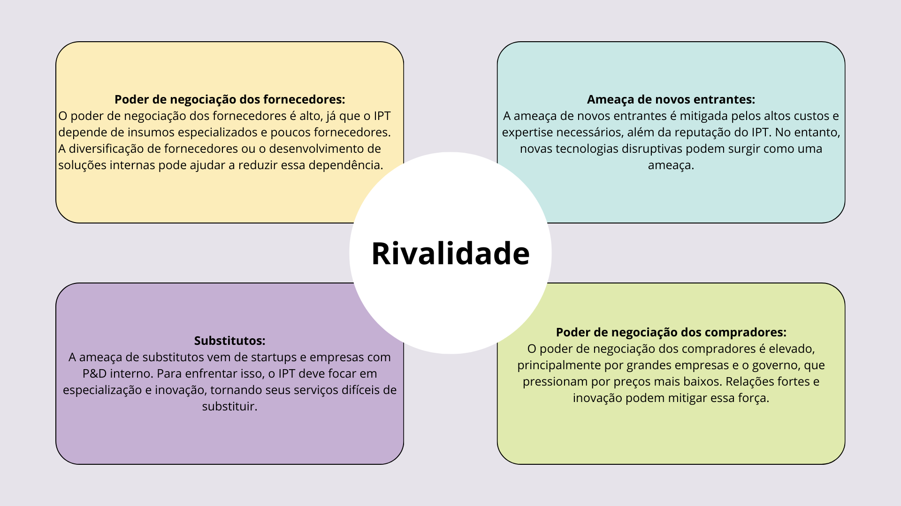 
Fonte: Material produzido pelos autores (2024)

 

##### 1. Rivalidade entre concorrentes:

&nbsp;&nbsp;&nbsp;&nbsp;A rivalidade entre os concorrentes é uma questão importante a ser enfrentada pelo IPT, visto que o cenário de Pesquisa e Desenvolvimento (P&D) no Brasil conta com diversas instituições, tanto as mais renomadas quanto as emergentes[[2]](#6). Universidades públicas como a USP, Unicamp e UFRJ possuem grandes centros de pesquisa, muitas vezes financiados por programas governamentais e que oferecem serviços semelhantes aos do IPT, como pesquisa aplicada, desenvolvimento de novas tecnologias e consultoria científica para a indústria. A Embrapa é outro concorrente importante, sendo um dos principais centros de pesquisa agropecuária do Brasil, com forte atuação em inovação tecnológica no agronegócio [[3]](#6), área que também pode cruzar com as atuações do IPT.
 &nbsp;&nbsp;&nbsp;&nbsp;Além disso, com o aumento de startups de tecnologia no Brasil e a evolução de centros de inovação privada, empresas como SENAI CIMATEC na Bahia e CPqD (Centro de Pesquisa e Desenvolvimento em Telecomunicações) em Campinas ganham relevância como players de peso na competição por projetos de pesquisa voltados para a indústria 4.0, telecomunicações e automação industrial. Essas instituições competem diretamente com o IPT, não apenas na busca por clientes corporativos, mas também por fundos de pesquisa e inovação.
 &nbsp;&nbsp;&nbsp;&nbsp;A rivalidade é acentuada pelo fato de que os serviços de pesquisa científica e tecnológica são frequentemente percebidos como similares pelos clientes, tornando o preço um fator determinante na escolha. Em um setor com crescimento lento e barreiras altas, a diferenciação se torna vital. O IPT, portanto, precisa destacar-se pela qualidade de suas soluções tecnológicas, oferecendo serviços únicos, como expertise em projetos de engenharia avançada, energias renováveis e biotecnologia, para não competir apenas por preço.

##### 2. Poder de barganha dos fornecedores:

&nbsp;&nbsp;&nbsp;&nbsp;No caso do IPT, o poder de barganha dos fornecedores é considerável. O instituto depende de insumos especializados, como equipamentos científicos avançados, softwares de modelagem e simulação e materiais para ensaios em laboratório, muitos dos quais são fornecidos por empresas multinacionais que dominam o mercado de tecnologia de ponta. Empresas como Siemens, General Electric e Dassault Systèmes fornecem sistemas e equipamentos de alto valor agregado para pesquisas em engenharia, automação e energia, e possuem uma base restrita de concorrentes.
 &nbsp;&nbsp;&nbsp;&nbsp;Esses fornecedores têm poder para aumentar os preços ou limitar o acesso a determinadas tecnologias, pressionando assim o IPT. Como esses insumos são críticos para o sucesso dos projetos de pesquisa do instituto, as opções de substituição são limitadas. Isso eleva o custo de mudança, especialmente em relação a equipamentos de longa durabilidade que exigem adaptações contínuas ao longo do tempo.
 &nbsp;&nbsp;&nbsp;&nbsp;Uma possível estratégia para o IPT mitigar essa força seria desenvolver parcerias estratégicas com fornecedores-chave, onde possam ser negociados melhores termos de fornecimento em troca de contratos de longo prazo ou envolvimento conjunto em projetos de inovação. Outra via seria buscar o desenvolvimento interno de tecnologias ou colaborar com startups e centros de tecnologia emergentes para criar soluções alternativas.

##### 3. Poder de barganha dos compradores:

 &nbsp;&nbsp;&nbsp;&nbsp;Os clientes do IPT — em grande parte compostos por empresas industriais, multinacionais, e entidades governamentais — têm um forte poder de barganha. Indústrias automobilísticas, como Volkswagen e General Motors, por exemplo, frequentemente contratam pesquisas voltadas para inovação de processos produtivos, eficiência energética e desenvolvimento de novos materiais. Além disso, grandes companhias de energia, como Petrobras e Eletrobras, são clientes importantes, e com seu grande poder de compra podem pressionar o IPT por preços mais baixos ou condições vantajosas.
 &nbsp;&nbsp;&nbsp;&nbsp;Quando os clientes são grandes e estratégicos para o IPT, como nesses casos, eles podem exigir mais flexibilidade nos prazos e maiores garantias de retorno sobre os projetos desenvolvidos. Além disso, muitos desses clientes podem buscar outras opções, incluindo universidades, centros internacionais de pesquisa ou até desenvolver seus próprios departamentos de P&D, o que aumenta ainda mais seu poder de barganha. Esse cenário força o IPT a buscar maneiras de diferenciar seus serviços, apostando em soluções personalizadas e na sua capacidade de lidar com desafios tecnológicos de alta complexidade.
 &nbsp;&nbsp;&nbsp;&nbsp;Uma maneira de lidar com esse poder de barganha é o IPT estreitar o relacionamento com seus principais clientes, oferecendo serviços que agreguem mais valor, como acompanhamento contínuo e transferência de tecnologia, além de garantir resultados práticos e aplicáveis a médio prazo. Isso pode aumentar a lealdade dos clientes e diminuir a sensibilidade ao preço.

##### 4. Ameaça de novos entrantes:

 &nbsp;&nbsp;&nbsp;&nbsp;A barreira de entrada no setor de P&D de alta tecnologia é elevada, especialmente devido ao grande investimento necessário em infraestrutura, conhecimento técnico e credibilidade. Um exemplo disso é o SENAI CIMATEC, que tem investido pesadamente em pesquisa aplicada e inovação, atraindo empresas nacionais e internacionais para projetos de P&D. O IPT, com sua longa história e reputação consolidada, tem uma vantagem significativa sobre novos entrantes, mas a rápida evolução tecnológica e a globalização podem facilitar o surgimento de novos competidores que trazem inovações disruptivas.
 &nbsp;&nbsp;&nbsp;&nbsp;Para competir com novos entrantes, o IPT deve continuar investindo em inovação e desenvolvimento de novas tecnologias que possam antecipar tendências emergentes, como a transformação digital, inteligência artificial, e biotecnologia. Outro ponto forte que o IPT pode explorar é sua rede de relacionamento com o governo e empresas locais, algo que novos entrantes podem ter dificuldade em desenvolver rapidamente.

##### 5. Ameaça de produtos ou serviços substitutos:

 &nbsp;&nbsp;&nbsp;&nbsp;A ameaça de substitutos é moderada, mas crescente. Empresas podem, cada vez mais, optar por desenvolver seus próprios centros de P&D ou terceirizar suas pesquisas para consultorias internacionais com expertise específica, como a McKinsey, que tem expandido seus serviços de P&D em inovação digital e industrial. Outro exemplo de substituto em potencial são startups especializadas em áreas como biotecnologia, que oferecem soluções mais ágeis e, muitas vezes, mais baratas.
 &nbsp;&nbsp;&nbsp;&nbsp;Além disso, o avanço das tecnologias digitais e softwares de simulação pode levar empresas a realizarem internamente pesquisas que antes exigiriam infraestrutura externa, como a do IPT. Para mitigar essa ameaça, o IPT deve focar em projetos de pesquisa que exigem alta especialização e infraestrutura, como testes em grande escala de materiais de construção, estudos avançados em energia renovável, ou soluções específicas para indústrias altamente reguladas, como a farmacêutica e a aeronáutica.

### 3.1.2. Análise SWOT

&nbsp;&nbsp;&nbsp;&nbsp;Segundo Teruchkin (2003), a análise SWOT, por meio de um inventário das forças e das fraquezas da empresa, das oportunidades e das ameaças do meio ambiente e do grau de adequação entre elas, busca verificar a competitividade da empresa. Desse modo, a fim de analisar a forma como o IPT está posicionado, estrturou-se a seguinte Matriz SWOT:

 

Figura 2 - Matriz SWOT
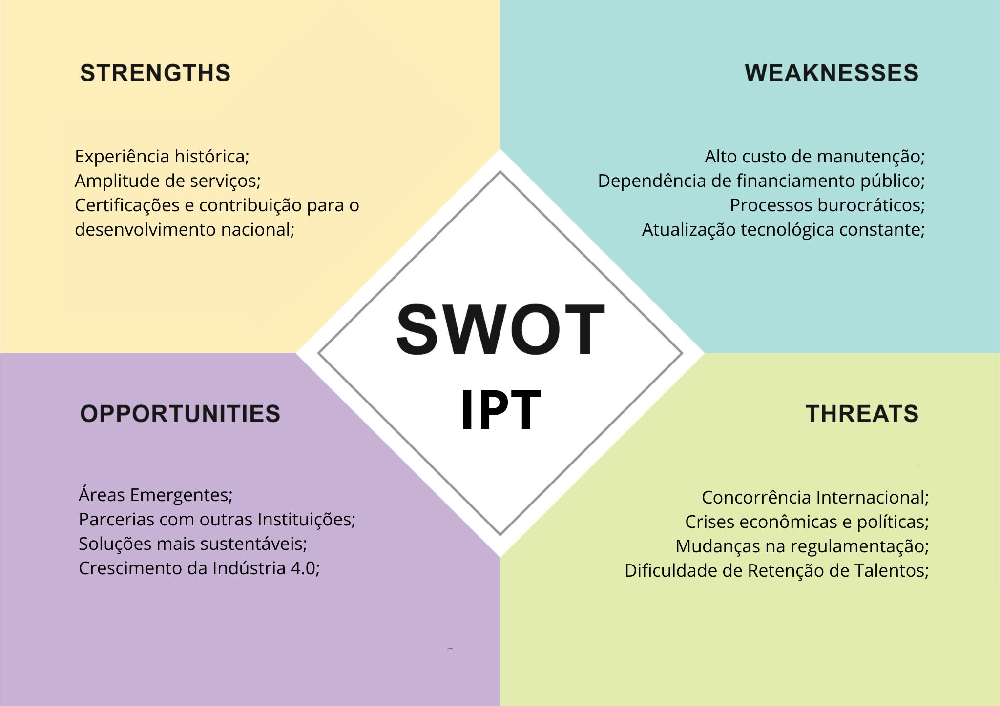
Fonte: Material produzido pelos autores (2024)

 

**Strengths**

&nbsp;&nbsp;&nbsp;&nbsp;O Instituto de Pesquisas Tecnológicas (IPT) possui longa trajetória, sendo uma das instituições de pesquisa mais antigas do Brasil. Ademais, ela oferece uma gama variada de serviços, como consultoria e ensaios, que são amplamente utilizados tanto no setor público quanto no privado. Além disso, participa ativamente no desenvolvimento nacional, contribuindo com certificações e padrões de qualidade para diferentes setores da economia.

**Weaknesses**

&nbsp;&nbsp;&nbsp;&nbsp;Quanto as fraquezas, vale ressaltar que o IPT enfrenta desafios relacionados ao alto custo de manutenção de sua infraestrutura e equipamentos, necessários para a realização de pesquisas. Assim também, a dependência de financiamento público limita a flexibilidade financeira e pode ser afetada por cortes orçamentários. O instituto também sofre com processos burocráticos, o que pode atrasar a execução de projetos. Outro ponto de atenção é a necessidade de atualizar constantemente a sua tecnologia para acompanhar as inovações no setor.

**Opportunities**

&nbsp;&nbsp;&nbsp;&nbsp;Há diversas oportunidades para o IPT explorar, como o crescimento de novas áreas tecnológicas, incluindo as relacionadas à sustentabilidade e inovação. Aliás, parcerias com outras instituições e empresas, como startups, podem trazer novos projetos e avanços tecnológicos. Bem como, a demanda por soluções sustentáveis está em expansão, o que permite ao IPT atuar em frentes relacionadas à sustentabilidade. Por fim, a Indústria 4.0, com foco em automação, também proporciona novas possibilidades para a instituição.

**Threats**

&nbsp;&nbsp;&nbsp;&nbsp;Uma ameaça para o IPT é a concorrência internacional de outros centros de pesquisa e inovação. As crises econômicas e políticas podem impactar diretamente o financiamento e a capacidade de execução de projetos. Além disso, como o instituto está relacionado a órgãos públicos, a regulamentação pode ser afetada, sujeitando o IPT a alterações em políticas e legislações que podem interferir em suas atividades e fontes de recursos. Assim também, há dificuldades em reter profissionais qualificados, uma vez que o mercado de tecnologia busca constantemente por talentos especializados.

&nbsp;&nbsp;&nbsp;&nbsp;Em suma, a análise SWOT do Instituto de Pesquisas Tecnológicas (IPT) evidencia seus pontos positivos e negativos de modo externo e interno. Pode-se perceber que a experiência acumulada, a amplitude de serviços e a contribuição para o desenvolvimento nacional são pontos fortes que posicionam o instituto como uma referência no Brasil. No entanto, questões como os altos custos de manutenção, a dependência de financiamento público e a necessidade de atualização tecnológica limitam a agilidade e a sustentabilidade financeira da instituição. Apesar dessas fraquezas, surgem oportunidades em áreas emergentes e nas parcerias com outras instituições, especialmente no contexto da Indústria 4.0 e da busca por soluções sustentáveis. Por outro lado, o IPT precisa lidar com ameaças como a concorrência global, crises políticas e econômicas, além da dificuldade em reter talentos. A capacidade do instituto de enfrentar esses desafios poderá para garantir sua relevância no mercado tecnológico.

### 3.1.3. Descrição da Solução a ser Desenvolvida

&nbsp;&nbsp;&nbsp;&nbsp;A proposta visa o desenvolvimento de uma tecnologia baseada em IoT, que permitirá um acompanhamento em tempo real de variáveis dos maquinários, como temperatura e tempo de operação, o que irá garantir maior eficiência na manutenção preventiva. A seguir, será detalhado o problema identificado, a visão de negócios da solução, aplicação, os benefícios esperados e os critérios de sucesso.

#### 3.1.3.1 Qual é o problema a ser resolvido

&nbsp;&nbsp;&nbsp;&nbsp;No IPT, o laboratório de processos metalúrgicos possui mais de 500 equipamentos que operam sob demanda. Não existe um sistema que permita o monitoramento contínuo de variáveis essenciais, dificultando a manutenção preventiva e aumentando a possibilidade de falhas inesperadas.

#### 3.1.3.2 Qual a solução proposta (visão de negócios)

&nbsp;&nbsp;&nbsp;&nbsp;A solução proposta é o desenvolvimento de um dispositivo IoT de baixo custo, capaz de monitorar variáveis como temperatura e tempo de operação dos equipamentos, integrando-se à infraestrutura existente e permitindo o acompanhamento contínuo de cada equipamento.

#### 3.1.3.3 Como a solução proposta deverá ser utilizada

&nbsp;&nbsp;&nbsp;&nbsp;A solução será aplicada diretamente aos equipamentos do laboratório. O dispositivo IoT coletará dados de forma contínua e os guardará, onde as informações poderão ser acessadas por técnicos e gestores para análise e planejamento de manutenção.

#### 3.1.3.4 Quais os benefícios trazidos pela solução proposta

&nbsp;&nbsp;&nbsp;&nbsp;Os principais benefícios incluem maior controle sobre o estado dos equipamentos, permitindo a realização de manutenções preventivas, reduzindo falhas inesperadas, prolongando a vida útil dos equipamentos e abaixando os custos de manutenção.

#### 3.1.3.5 Qual será o critério de sucesso e qual medida será utilizada para o avaliar

&nbsp;&nbsp;&nbsp;&nbsp;O sucesso será medido pela implementação e operação contínua do dispositivo IoT, com base em indicadores como a redução de falhas inesperadas, o aumento da vida útil dos equipamentos e a diminuição dos custos operacionais relacionados à manutenção.
&nbsp;&nbsp;&nbsp;&nbsp;Em conclusão, o dispositivo IoT proposto para o laboratório do IPT permitirá monitoramento contínuo dos equipamentos, reduzindo custos e aumentando a vida útil, contribuindo para uma melhora na eficiência da manutenção e o contínuo uso das tecnológias no instituto.

### 3.1.4. Value Proposition Canvas

&nbsp;&nbsp;&nbsp;&nbsp;O Canvas de Proposta de Valor, criado por Osterwalder et al. (2014), é um instrumento visual empregado para esclarecer e transmitir como um produto ou serviço gera valor para seus consumidores. Ele ajuda a identificar claramente as necessidades, dores e desejos dos clientes (Customer Profile) e alinha essas informações com as soluções oferecidas pela empresa (Value Map). A meta é validar que a proposta corresponda às expectativas e desafios do público-alvo, enfatizando como ela proporciona vantagens e soluciona os problemas.

  
  <figcaption style="font-size: 12px; text-align: center;">Imagem X - Canvas de Proposta de Valor</figcaption>

&nbsp;&nbsp;&nbsp;&nbsp;As principais necessidades dos clientes (segmento de clientes) incluem a redução de custos operacionais, a maximização da vida útil dos equipamentos e o monitoramento eficiente para evitar falhas inesperadas e a solução proposta, por meio de dispositivos de baixo custo para monitoramento e relatórios de interconexão, visa atender a essas necessidades, oferecendo benefícios como maior controle sobre a alocação de recursos, redução de custos de manutenção e melhor integração com a rede IoT existente.
 
&nbsp;&nbsp;&nbsp;&nbsp;Dessa forma, o projeto alinha-se diretamente aos objetivos do IPT, garantindo a manutenção preventiva eficiente e a otimização dos processos de laboratório.

### 3.1.5. Matriz de Riscos

&nbsp;&nbsp;&nbsp;&nbsp;A Matriz de Riscos e Oportunidades é uma ferramenta importante para identificar e avaliar as chances de sucesso durante o desenvolvimento de um projeto. Ela permite organizar e classificar as oportunidades de acordo com a probabilidade de ocorrência e o impacto positivo que elas podem gerar, caso se realizem.

Figura 3 - Matriz de Oportunidades 
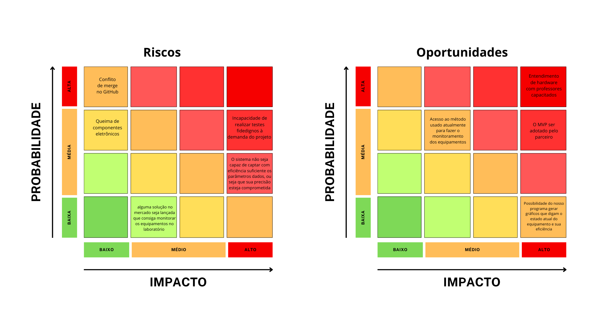  
Fonte: Material produzido pelos autores (2024)

&nbsp;&nbsp;&nbsp;&nbsp; Ao dispor essas oportunidades de forma crescente, torna-se mais fácil priorizar aquelas que merecem mais atenção e recursos. Com isso, a matriz facilita uma gestão estratégica do projeto, focada no crescimento e no aproveitamento máximo das oportunidades disponíveis.

## Riscos

&nbsp;&nbsp;&nbsp;&nbsp;A matriz de risco é uma ferramenta visual que avalia e classifica os riscos de um projeto com base na probabilidade de ocorrência e no impacto potencial, facilitando a priorização de ações preventivas. Ela ajuda a equipe a tomar decisões estratégicas para mitigar riscos e garantir o sucesso do projeto.

#### **Conflito de merge no GitHub**

- **Descrição:** Durante o desenvolvimento do projeto, pode ocorrer conflitos de merge no GitHub quando vários membros da equipe estão trabalhando em diferentes partes do código ao mesmo tempo.
- **Impacto:** Pode atrasar o progresso do desenvolvimento e gerar retrabalho se os conflitos não forem resolvidos adequadamente.
- **Plano de Resposta ao Risco:** Implementar práticas eficazes de controle de versão, como fazer commits menores, comunicação constante sobre as partes do código em desenvolvimento e revisões de código frequentes para minimizar conflitos.

#### **Queima de componentes eletrônicos**

- **Descrição:** Existe a possibilidade de falha ou queima de componentes eletrônicos utilizados no projeto, especialmente durante os testes de hardware.
- **Impacto:** Pode gerar custos adicionais e atrasos no cronograma do projeto devido à necessidade de substituir os componentes.
- **Plano de Resposta ao Risco:** Garantir o uso adequado de componentes eletrônicos e realizar testes preliminares com simulações e verificações antes da implementação final. Ter peças sobressalentes disponíveis pode reduzir o impacto desse risco.

#### **Incapacidade de realizar testes fidedignos à demanda do projeto**

- **Descrição:** O projeto pode enfrentar dificuldades em realizar testes que realmente representem as condições do ambiente real em que o produto será aplicado.
- **Impacto:** Os resultados dos testes podem não refletir a eficiência e confiabilidade do sistema, comprometendo a entrega do produto final.
- **Plano de Resposta ao Risco:** Desenvolver um plano de testes robusto que inclua a simulação de diversas condições reais. Aumentar a parceria com usuários e stakeholders para garantir que as condições dos testes sejam as mais próximas possíveis da realidade.

#### **O sistema não ser capaz de captar com eficiência suficiente os parâmetros de dados, ou seja, que sua precisão esteja comprometida**

- **Descrição:** Existe o risco de que o sistema IoT desenvolvido não consiga captar os dados de monitoramento com a precisão e eficiência necessárias para atingir os objetivos do projeto.
- **Impacto:** Pode prejudicar a confiabilidade dos dados capturados, comprometendo a qualidade do monitoramento e das análises geradas pela solução.
- **Plano de Resposta ao Risco:** Trabalhar para garantir uma seleção adequada de sensores e uma calibragem constante dos equipamentos para aumentar a precisão da captura de dados.

#### **Alguma solução no mercado seja lançada que consiga monitorar os equipamentos no laboratório**

- **Descrição:** Existe o risco de uma solução concorrente ser lançada no mercado durante o desenvolvimento do projeto, oferecendo uma alternativa melhor ou mais avançada.
- **Impacto:** Pode reduzir a competitividade do projeto e fazer com que a solução perca relevância diante de novas tecnologias.
- **Plano de Resposta ao Risco:** Acompanhar constantemente as tendências de mercado e inovações para adaptar o projeto conforme necessário e incorporar diferenciais competitivos que mantenham sua atratividade.

## Oportunidades

#### **Entendimento de Hardware com Professores Capacitados**

- **Descrição:** A equipe terá acesso ao conhecimento especializado de professores capacitados na área de hardware, permitindo maior compreensão e melhor desenvolvimento do projeto.
- **Impacto:** Melhora a implementação de componentes de hardware e garante maior eficiência na integração dos dispositivos IoT.
- **Plano de Resposta à Oportunidade:** Aumentar a probabilidade e impactos da oportunidade.

#### **O MVP ser adotado pelo parceiro**

- **Descrição:** O MVP (Produto Mínimo Viável) do projeto pode ser adotado por um parceiro estratégico, proporcionando validação e aplicabilidade real do sistema no mercado.
- **Impacto:** Aumenta as chances de sucesso do projeto, abrindo portas para investimentos e parcerias futuras.
- **Plano de Resposta à Oportunidade:** Garantir o acompanhamento próximo com o parceiro para facilitar a adoção do MVP.

#### **Acesso ao método usado atualmente para fazer o monitoramento dos equipamentos**

- **Descrição:** Ter acesso ao método de monitoramento já utilizado no laboratório ou em indústrias permitirá à equipe comparar e validar as funcionalidades da solução proposta.
- **Impacto:** Facilita a verificação de eficiência da solução, proporcionando uma base para melhorias ou adaptações.
- **Plano de Resposta à Oportunidade:** Aumentar a probabilidade de acesso e utilizar esse conhecimento para otimizar o desenvolvimento.

#### **Possibilidade de o nosso programa gerar gráficos que ligam o estado atual do equipamento e sua eficiência**

- **Descrição:** A solução desenvolvida pode gerar gráficos e relatórios que acompanham o estado do equipamento em tempo real, facilitando o monitoramento de eficiência.
- **Impacto:** Melhora a visualização de dados para gestores e engenheiros, otimizando decisões baseadas em dados de performance.
- **Plano de Resposta à Oportunidade:** Estimular a aplicação da funcionalidade na versão final do projeto para aumentar seu valor agregado.

### 3.1.6. Política de Privacidade de acordo com a LGPD

&nbsp;&nbsp;&nbsp;&nbsp;A LGPD (Lei Geral de Proteção de Dados) é a legislação brasileira que regula o tratamento de dados pessoais, garantindo a privacidade e proteção dos direitos dos indivíduos. Ela estabelece regras sobre coleta, armazenamento e compartilhamento de dados, exigindo o consentimento do titular e medidas de segurança. Seu objetivo é assegurar o controle dos cidadãos sobre suas informações pessoais.

#### 3.1.6.1 Informações gerais sobre a empresa / organização 

&nbsp;&nbsp;&nbsp;&nbsp;O Instituto de Pesquisas Tecnológicas (IPT), fundado em 1899, é um renomado instituto vinculado ao Governo do Estado de São Paulo, que oferece soluções tecnológicas de ponta para diversos setores da economia, governos e sociedade. Com infraestrutura laboratorial extraordinária e equipes multidisciplinares altamente capacitadas, o IPT se dedica ao desenvolvimento e à inovação contínua no campo tecnológico.

#### 3.1.6.2 Informações sobre o tratamento de dados 

&nbsp;&nbsp;&nbsp;&nbsp;O IPT trata os dados coletados com o máximo cuidado e rigor, sempre em conformidade com a Lei Geral de Proteção de Dados (LGPD). Os dados são usados exclusivamente para monitorar e melhorar o desempenho dos equipamentos de laboratório, assegurando a confidencialidade e segurança.

#### 3.1.6.3 Quais são os dados coletados 

&nbsp;&nbsp;&nbsp;&nbsp;Os dados coletados incluem informações sobre o funcionamento dos equipamentos, como temperatura e número de horas em operação. Também podem ser coletados dados sobre a manutenção dos equipamentos.

#### 3.1.6.4 Onde os dados são coletados 

&nbsp;&nbsp;&nbsp;&nbsp;Os dados são coletados diretamente dos dispositivos de IoT instalados nos equipamentos dos laboratórios. Esses dispositivos são cuidadosamente posicionados para garantir a máxima precisão e eficiência.

#### 3.1.6.5 Para quais finalidades os dados serão utilizadas 

&nbsp;&nbsp;&nbsp;&nbsp;Os dados serão usados para monitorar as condições dos equipamentos, garantindo um planejamento de manutenção mais eficaz, prolongando a vida útil dos aparelhos e evitando paradas não planejadas.

#### 3.1.6.6 Onde os dados ficam armazenados 

&nbsp;&nbsp;&nbsp;&nbsp;Os dados coletados pelos dispositivos IoT são armazenados em servidores dedicados ao sistema de monitoramento, localizados no próprio Instituto de Pesquisa Tecnológica (IPT), com infraestrutura de segurança.

#### 3.1.6.7 Qual o período de armazenamento dos dados (retenção) 

&nbsp;&nbsp;&nbsp;&nbsp;Os dados serão armazenados durante o período necessário para o cumprimento das finalidades para as quais foram coletados, respeitando os requisitos legais e regulatórios aplicáveis.

#### 3.1.6.8 Uso de cookies e/ou tecnologias semelhantes 

&nbsp;&nbsp;&nbsp;&nbsp;Cookies podem ser usados para otimizar a experiência do usuário em plataformas digitais utilizadas para consultar os dados coletados. Estas tecnologias ajudam a garantir que o sistema funcione de forma fluida e eficiente.

#### 3.1.6.9 Com quem esses dados são compartilhados (parceiros, fornecedores, subcontratados) 

&nbsp;&nbsp;&nbsp;&nbsp;Os dados coletados poderão ser compartilhados com:

- Parceiros de tecnologia para manutenção do sistema de IoT.
- Equipes de operação e manutenção do laboratório.
- Prestadores de serviços que auxiliem na operação do sistema.
- Todos os terceiros que recebem dados são obrigados a cumprir os requisitos da LGPD.

#### 3.1.6.10 Informações sobre medidas de segurança adotadas pela empresa 

&nbsp;&nbsp;&nbsp;&nbsp;O IPT adota medidas de segurança apropriadas, incluindo o uso de criptografia, firewalls e controle de acesso, para proteger os dados contra acesso não autorizado, perda, roubo ou alteração.

#### 3.1.6.11 Orientações sobre como a empresa/organização atende aos direitos dos usuários 

De acordo com a LGPD, os titulares de dados podem solicitar:

- Confirmação de tratamento de dados.
- Acesso aos dados pessoais armazenados.
- Correção de dados incompletos, inexatos ou desatualizados.
- Exclusão de dados pessoais quando aplicável.

#### 3.1.6.12 Informações sobre como o titular de dados pode solicitar e exercer os seus direitos 

&nbsp;&nbsp;&nbsp;&nbsp;Os titulares de dados podem entrar em contato com o IPT por meio de nosso DPO (Data Protection Officer) para exercer seus direitos garantidos pela LGPD. Nosso time estará sempre pronto para responder a quaisquer dúvidas ou solicitações.

#### 3.1.6.13 Informações de contato do Data Protection Officer (DPO) ou encarregado de proteção de dados da organização 

&nbsp;&nbsp;&nbsp;&nbsp;Para quaisquer questões relacionadas à proteção de dados, o contato do nosso encarregado de proteção de dados é:

### 3.1.7. Bill of Material (BOM) 

&nbsp;&nbsp;&nbsp;&nbsp;BOM (Bill of Material) pode ser definido como uma lista completa de materiais, que detalha todos os itens necessários para construir, fabricar ou reparar um produto.

Figura 4 - Persona (Olga Ribeiro) 
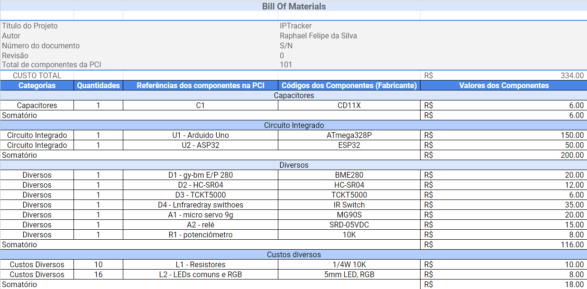  
Fonte: Material produzido pelos autores (2024)

&nbsp;&nbsp;&nbsp;&nbsp;Essa lista contém uma média dos valores encontrados no mercado, durante uma pesquisa na internet durante o desenvolvimento inicial do projeto. Os preços podem variar conforme disponibilidade e data, mas o BOM atual é capaz de fornecer uma boa visão sobre o custo de replicar o projeto desenvolvido nesse repositório.

&nbsp;&nbsp;&nbsp;&nbsp;Além de oferecer uma visão dos custos, o BOM é uma excelente ferramenta para o controle orçamentário, permitindo o acompanhamento dos gastos e ajustes financeiros conforme necessidade. Ele também auxilia na gestão de estoque, evitando excessos ou faltas nos materiais, o que gera economia e otimiza os recursos.

&nbsp;&nbsp;&nbsp;&nbsp;Dessa forma, o BOM tem como utilidade a noção sobre os custos dos materiais para replicar o IoT, realizar controle orçamentário e garantir que sempre existes peças disponíveis quando necessários.

## 3.2. Domínio de Fundamentos de Experiência de Usuário 

&nbsp;&nbsp;&nbsp;&nbsp;Essa seção apresenta conceitos essenciais para a construção de soluções centradas no usuário, abordando desde a criação de personas até ferramentas como User Stories e Storyboards. Este capítulo detalha como essas metodologias contribuem para compreender as necessidades, desejos e desafios dos usuários, promovendo o desenvolvimento de sistemas mais alinhados às expectativas do público-alvo. A partir de estudos teóricos e dados coletados em campo, a equipe buscou humanizar o processo de design, garantindo que decisões estratégicas sejam orientadas pela experiência do usuário.

### 3.2.1. Personas 

&nbsp;&nbsp;&nbsp;&nbsp;Sabe-se que foi Alan Cooper (1999) o criador do método que auxilia os profissionais a conhecerem melhor e desenvolverem mais empatia pelos usuários. Segundo o autor, o objetivo na construção das personas está em representar a diversidade de motivações, comportamentos, atitudes, aptidões, restrições, modelos mentais, trabalho ou fluxo de atividade, ambiente e frustrações com o produto ou sistema. Assim, para compreender de forma mais fiel a dor do atual parceiro, desenvolveu-se a seguinte persona:

Figura 5 - Persona (Inês Pereira Tavares) 
  
Fonte: Material produzido pelos autores (2024)

&nbsp;&nbsp;&nbsp;&nbsp;A persona criada foi pensada para representar um público-alvo fictício da aplicação. Assim, ela consiste em uma mulher chamada Inês Pereira Tavares, pesquisadora de 43 anos com experiência em engenharia metalúrgica. Inês enfrenta desafios na otimização e manutenção de equipamentos, e seu trabalho exige soluções tecnológicas, como o uso de IoT para monitoramento em tempo real e identificação precoce de falhas em maquinários. Com uma carreira estabilizada, ela lida com altos custos de manutenção corretiva e falta de histórico de desempenho dos equipamentos, o que a impede de encontrar formas de melhorar a eficiência dos processos industriais. Seus principais interesses incluem novas tecnologias e metodologias para a manutenção de máquinas e processos.

&nbsp;&nbsp;&nbsp;&nbsp;Vale ressaltar que a estimativa de idade, formação, região e outros dados demográficos foram baseados em informações fornecidas pela empresa parceira durante o Kick-Off, inspirando-se nos colaboradores reais do IPT. Da mesma forma, o cenário de interação dos usuários pôde ser compreendido detalhadamente a partir da visita técnica ao ambiente do instituto, visualizando os equipamentos. Além disso, os interesses e desejos da persona foram extraídos do Termo de Abertura de Projetos do Inteli, onde foram delineadas as dores enfrentadas pelos clientes.

&nbsp;&nbsp;&nbsp;&nbsp;Outra fonte de dados foi a pesquisa bibliográfica. Segundo uma monografia sobre "TECNOLOGIAS APLICADAS NA INDÚSTRIA 4.0: AVANÇOS NA INDÚSTRIA AUTOMOBILÍSTICA, METALÚRGICA E MINERAL", o IoT na indústria metalúrgica pode ser exemplificado por um sistema supervisório automatizado, composto por softwares e hardware que coletam dados de sensores e dispositivos instalados nas máquinas, permitindo que os operadores acompanhem e controlem os processos de produção. Essa pesquisa também contribuiu para estabelecer as dores, necessidades e desejos da persona.

&nbsp;&nbsp;&nbsp;&nbsp;Dessa forma, entende-se que as personas ajudam a humanizar o público-alvo, permitindo que as tomadas de decisão neste projeto sejam centradas no usuário. Criando personas detalhadas, tornou-se possível enxergar as necessidades, desejos e dores dos usuários de forma concreta, o que facilita a criação de soluções mais personalizadas. No caso de Inês Pereira Tavares, suas principais dores incluem os elevados custos de manutenção corretiva e a falta de dados históricos sobre o desempenho dos equipamentos, dificultando a otimização industrial.

&nbsp;&nbsp;&nbsp;&nbsp;Por fim, a criação de personas, como Inês Pereira Tavares, é uma ferramenta poderosa para representar o público-alvo de forma realista, considerando seus desafios, necessidades e interesses. Ao unir dados reais, pesquisas bibliográficas e visitas técnicas, foi possível construir perfis que guiam o desenvolvimento de produtos e serviços mais adequados e eficientes. Além disso, as personas humanizam o processo de design, ajudando a equipe a tomar decisões mais centradas nos usuários.

#### 3.2.1.2 Users Stories 

&nbsp;&nbsp;&nbsp;&nbsp;As _User Stories_, introduzidas no contexto do desenvolvimento ágil por Beck et al. (1999), são uma ferramenta essencial para garantir que as necessidades dos usuários finais sejam levadas em consideração durante o processo de desenvolvimento de sistemas e soluções. Ao humanizar o processo de desenvolvimento, elas permitem que a equipe compreendam melhor as metas, expectativas e desafios enfrentados pelos usuários.

&nbsp;&nbsp;&nbsp;&nbsp; Visando atingir esse ideal, criamos algumas _User Stories_, baseadas nas personas que foram discutidas anteriormente:

- USO1 (referente a Olga Ribeiro): Eu, como responsável pelas operações do laboratório, quero acessar informações sobre desempenho dos equipamentos para dar continuidade às operações do ipt.

- US02 (referente a Inês Pereira Tavares): Eu, como engenheira metalurgica, quero ser notificada com relatorios de manutenção, a fim de evitar gastos desnecessários com eventuais falhas.

&nbsp;&nbsp;&nbsp;&nbsp;Essas User Stories destacam a importância de fornecer informações acessíveis e relatórios automatizados aos usuários do IoT, visando melhorar a eficiência das operações e reduzir custos com falhas de equipamentos e manutenções desnecessárias.

### 3.2.2. Jornada do Usuário e Storyboard 

#### 3.2.2.1. Jornada do usuário 

&nbsp;&nbsp;&nbsp;&nbsp;Segundo Boag (2015), o mapa de jornada do usuário deve se concentrar em uma determinada parte da história ou dar uma visão geral de toda a experiência e tem como objetivo identificar interações fundamentais que o usuário tem com a organização que deu origem ao produto. Para Martin & Hanington (2012), essa jornada deve perpassar por momentos positivos, negativos e neutros na interação com um produto ao longo de um período de tempo, desde a observação do problema, até a implementação da ideia. Com base nisso, foi definido o seguinte mapa de jornada para a persona previamente criada, a pesquisadora Inês.

Figura 6 - Mapa de Jornada (Inês Pereira Tavares) 
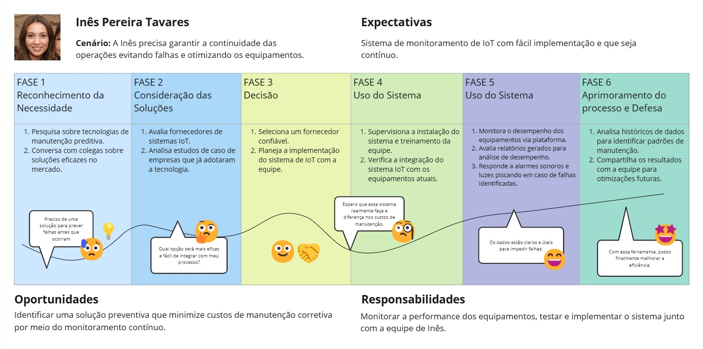  
Fonte: Material produzido pelos autores (2024)

&nbsp;&nbsp;&nbsp;&nbsp;Por meio da criação desse mapa, tornou-se possível compreender de forma mais profunda os pontos de contato entre Inês e o sistema, identificando suas principais necessidades, desafios e expectativas ao longo de cada etapa da jornada. Esse entendimento detalhado permite que a equipe de desenvolvimento e atendimento ajuste o produto e o suporte oferecido, otimizando a experiência da usuária e proporcionando um valor agregado ao seu trabalho.

&nbsp;&nbsp;&nbsp;&nbsp;Além disso, fica evidente que ao longo do processo, Inês experimenta uma mistura de sentimentos, começando com incerteza e dúvidas ao reconhecer a necessidade de uma solução que a auxilie. Logo depois, ela enfrenta obstáculos ao avaliar diferentes fornecedores e integrar o novo sistema, mas com o tempo, vê resultados positivos no desempenho dos equipamentos. Por fim, isso gera uma crescente satisfação, culminando em um sentimento de realização ao perceber que o sistema realmente contribui para a realização de manutenções e prevenção de grandes falhas.

&nbsp;&nbsp;&nbsp;&nbsp;Além disso, o mapa de jornada destaca momentos críticos de frustração e satisfação de Inês, como dificuldades com custos de manutenção e a falta de dados históricos para otimização dos processos industriais. Com essas informações, torna-se possível direcionar esforços para criar funcionalidades que ajudem no planejamento de manutenções e ofereçam insights de eficiência energética, facilitando o gerenciamento dos equipamentos.

&nbsp;&nbsp;&nbsp;&nbsp;Em suma, pode-se compreender oportunidades para melhorar a usabilidade do sistema, como implementar alertas sonoros e visuais, bem como o desenvolvimento de dashboards e outras ferramentas de análise. Dessa forma, o mapa de jornada contribui para que as decisões de design e desenvolvimento do sistema sejam mais centradas na usuária, Inês, promovendo uma experiência mais satisfatória desde o primeiro contato até a implementação e uso contínuo do produto.

#### 3.2.2.2. Storyboard 

&nbsp;&nbsp;&nbsp;&nbsp;Storyboards, criados inicialmente por Walt Disney Studios na década de 1930, são sequências visuais que ilustram etapas ou interações de um usuário com um sistema ou produto, apresentadas como uma série de quadros[[4]](#5-referências). Eles ajudam a visualizar e planejar a experiência do usuário, mostrando como ele interage com o projeto em diferentes cenários.

&nbsp;&nbsp;&nbsp;&nbsp;Para o projeto em questão, o storyboard é importante porque permite ver o fluxo completo das ações do usuário com o sistema de monitoramento de manutenção. Ele ajuda a identificar pontos críticos onde o sistema deve fornecer informações claras, como notificações de alerta e relatórios, facilitando a compreensão das necessidades do usuário e garantindo que o projeto atenda a essas demandas de forma eficiente.

&nbsp;&nbsp;&nbsp;&nbsp;A fim de traçar os storyboards abaixo, foram utilizadas as User Stories US01 e US02, presentes na seção acima.

##### Storyboard - Monitoramento de Temperatura de Equipamentos de Laboratório

###### Cena 1: Ativação do Dispositivo

- **Contexto**: O usuário, um técnico de laboratório, inicia sua rotina e precisa monitorar os equipamentos para evitar superaquecimentos que possam comprometer o funcionamento.
- **Ação do Usuário**: O técnico aproxima-se do dispositivo e pressiona o **botão de liga/desliga** para ativá-lo.
- **Feedback do Dispositivo**: O **LED verde** acende, indicando que o sistema está ligado. O **LCD** exibe uma mensagem inicial mostrando a temperatura atual do equipamento monitorado e o status "Temp Normal" caso a temperatura esteja abaixo do limite crítico.

###### Cena 2: Monitoramento Contínuo

- **Contexto**: O dispositivo está em funcionamento normal, monitorando a temperatura do equipamento e atualizando a leitura a cada 2 segundos.
- **Ação do Usuário**: O técnico observa o LCD ocasionalmente para verificar a temperatura e o status, especialmente quando os equipamentos estão em uso contínuo.
- **Feedback do Dispositivo**: O **LCD** exibe a temperatura em tempo real, mostrando "Temp Normal" enquanto a temperatura estiver dentro dos limites seguros.

###### Cena 3: Alerta de Temperatura Alta

- **Contexto**: A temperatura do equipamento ultrapassa 25°C, o que exige atenção imediata para evitar problemas maiores.
- **Ação do Usuário**: Ao ouvir o som do **buzzer** e ver o **LED vermelho** aceso, o técnico percebe que a temperatura está acima do limite seguro.
- **Feedback do Dispositivo**:
  - O **buzzer** emite um som de alerta.
  - O **LED vermelho** acende, sinalizando visualmente o alerta.
  - O **LCD** exibe a mensagem "ALERTA: Temp Alta" junto com a temperatura atual, chamando a atenção do técnico para verificar o equipamento.

###### Cena 4: Intervenção do Usuário

- **Contexto**: O técnico entende que o equipamento precisa de intervenção para reduzir a temperatura e evitar superaquecimento.
- **Ação do Usuário**: Ele desliga ou ajusta o uso do equipamento monitorado para permitir o resfriamento ou realiza manutenção conforme necessário.
- **Feedback do Dispositivo**: Enquanto o técnico ajusta o equipamento, ele continua monitorando o **LCD** até que a temperatura volte ao nível normal e o alerta pare.

###### Cena 5: Retorno ao Status Normal

- **Contexto**: Após a intervenção do técnico, a temperatura do equipamento volta a ficar abaixo de 25°C.
- **Ação do Usuário**: O técnico verifica o LCD para confirmar que a situação foi normalizada.
- **Feedback do Dispositivo**:
  - O **buzzer** se desliga.
  - O **LED vermelho** apaga.
  - O **LCD** retorna a exibir "Temp Normal", indicando que o equipamento voltou a operar dentro da faixa de temperatura segura.

###### Cena 6: Desligamento do Dispositivo

- **Contexto**: No final do expediente, o técnico decide desligar o sistema de monitoramento para economizar energia ou ao encerrar o uso do equipamento.
- **Ação do Usuário**: O técnico pressiona o botão de liga/desliga novamente para desativar o sistema.
- **Feedback do Dispositivo**:
  - O **LED verde** apaga, indicando que o sistema foi desligado.
  - O **LCD** é limpo e se apaga.
  - Todo o sistema entra em modo de espera até a próxima ativação.

Figura 7 - Storyboard: Monitoramento de Temperatura de Equipamentos de Laboratório 
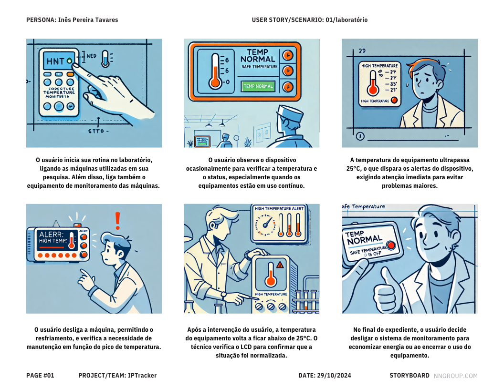  
Fonte: Material produzido pelos autores (2024)

---

##### Storyboard - Notificação de Relatórios de Manutenção

###### Cena 1: Recebendo uma Notificação de Relatório de Manutenção

- **Contexto**: A engenheira metalúrgica está trabalhando em seu computador quando recebe uma notificação no celular ou na tela de seu computador.
- **Ação do Usuário**: Ela percebe a notificação e se prepara para verificar o relatório.
- **Feedback do Dispositivo**: A notificação informa que um novo relatório de manutenção está disponível, indicando que há atualizações sobre o estado dos equipamentos.

###### Cena 2: Acessando o Relatório de Manutenção

- **Contexto**: A engenheira abre o sistema de monitoramento e navega até a seção de relatórios de manutenção.
- **Ação do Usuário**: Ela acessa o relatório recente, onde encontra informações detalhadas sobre o status dos equipamentos.
- **Feedback do Sistema**: O sistema exibe uma visão geral do estado dos equipamentos, incluindo detalhes de operação, temperatura, e alertas recentes.

###### Cena 3: Análise do Relatório de Manutenção

- **Contexto**: A engenheira analisa o relatório detalhado, focando nos equipamentos que estão próximos da necessidade de manutenção.
- **Ação do Usuário**: Ela identifica os equipamentos com sinais de desgaste ou que apresentam risco de falhas, priorizando aqueles que precisam de intervenção.
- **Feedback do Sistema**: O relatório apresenta informações como horas de operação, eventos de temperatura alta e históricos de manutenção, ajudando a engenheira a avaliar o estado de cada equipamento.

###### Cena 4: Tomando Decisões Preventivas

- **Contexto**: Com base no relatório, a engenheira decide quais equipamentos precisam de manutenção preventiva para evitar falhas e custos excessivos.
- **Ação do Usuário**: Ela agenda uma manutenção preventiva para os equipamentos críticos e comunica a equipe de manutenção sobre as ações necessárias.
- **Feedback do Sistema**: O sistema permite que ela marque os equipamentos como "Agendados para Manutenção", gerando um registro para a equipe de manutenção.

###### Cena 5: Preparação para a Manutenção

- **Contexto**: A engenheira revisa os procedimentos de manutenção e garante que as peças e ferramentas necessárias estão disponíveis para a intervenção.
- **Ação do Usuário**: Ela revisa a lista de peças e itens de manutenção necessários e coordena a logística para que estejam prontos no dia da intervenção.
- **Feedback do Sistema**: O sistema exibe uma lista de materiais e etapas de manutenção recomendadas, facilitando a preparação.

###### Cena 6: Verificando o Status Após a Manutenção

- **Contexto**: Após a manutenção, a engenheira recebe uma nova notificação confirmando que os equipamentos estão funcionando de acordo com os padrões.
- **Ação do Usuário**: Ela verifica o status atualizado dos equipamentos no sistema e confirma que todos estão em condições ideais.
- **Feedback do Sistema**: O sistema mostra o status dos equipamentos como "Normal" e apresenta um relatório atualizado, indicando que a manutenção foi bem-sucedida.

Figura 8 - Storyboard: Relatório de Manutenção 
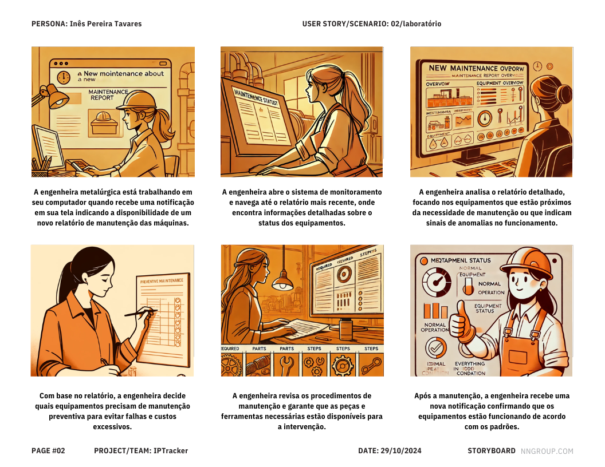  
Fonte: Material produzido pelos autores (2024)

---

&nbsp;&nbsp;&nbsp;&nbsp;O storyboard do Monitoramento de Temperatura de Equipamentos de Laboratório e do Relatório de Manutenção fornecem uma visão detalhada da interação do usuário com o sistema, desde a recepção de alertas até a tomada de decisões preventivas. Esses fluxos visuais ajudam a identificar os momentos críticos em que o sistema precisa oferecer feedback claro e ações intuitivas para o usuário, promovendo uma experiência melhor e mais eficiente.

&nbsp;&nbsp;&nbsp;&nbsp;Através desses storyboards, é possível garantir que o projeto atenda às necessidades operacionais de pesquisadores e engenheiros, facilitando o monitoramento contínuo e a tomada de decisões com base em dados em tempo real. Esse detalhamento também serve como uma ferramenta de comunicação importante para alinhar todos os envolvidos no projeto, desde desenvolvedores até usuários finais, assegurando que o sistema ofereça uma solução prática e eficaz para o gerenciamento de equipamentos e manutenção preventiva.

## 3.3. Solução Técnica 

&nbsp;&nbsp;&nbsp;&nbsp;Em relação à solução, ela será específicada ao decorrer de alguns tópicos (presentes abaixo) que terão como objetivo contemplar a funções técnicos de uso (por meio dos requisitos funcionais), funções técnicas voltadas para eficiência e otimização do funcionamento dos dispositivo (por meio dos requisitos não funcionais), a arquitetura base da solução e as demonstrações de ambos os protótipos iniciais e refinado, ao término de seus respectivos desenvolvimentos.

### 3.3.1. Requisitos Funcionais 

&nbsp;&nbsp;&nbsp;&nbsp;Requisitos funcionais, conceito amplamente difundido no campo da engenharia de software, são utilizados para o desenvolvimento _software_, sendo mais específico, são especificações que descrevem as operações e funcionalidades que o sistema deve realizar para conseguir atender aos objetivos. Esses requisitos geralmente descrevem as interações diretas do usuário com o software e as operações que o sistema deve executar em resposta a determinadas entradas.[[5]](#5-referências)

| **RF#**  | **Descrição**                                                                                                                                                                              | **Regra de negócio**                                                                                                                                                        |
| -------- | ------------------------------------------------------------------------------------------------------------------------------------------------------------------------------------------ | --------------------------------------------------------------------------------------------------------------------------------------------------------------------------- |
| **RF01** | O sistema deve realizar a coleta de dados de variáveis relevantes dos equipamentos (como temperatura e tempo de operação) por meio de sensores instalados nos equipamentos de laboratório. | **RN01**: Cada equipamento monitorado deve ser associado a um identificador único dentro do sistema, garantindo a rastreabilidade dos dados coletados.                      |
| **RF02** | O dispositivo deve ser capaz de formatar os dados coletados de acordo com o protocolo MQTT para transmissão eficiente dos dados à plataforma de monitoramento.                             | **RN02**: A transmissão de dados deve seguir o protocolo MQTT, garantindo eficiência na comunicação com a plataforma.                                                       |
| **RF03** | O sistema deve estabelecer uma conexão WiFi com a rede do laboratório para enviar os dados coletados em tempo real, mesmo em ambiente com ruído industrial.                                | -                                                                                                                                                                           |
| **RF04** | O dispositivo IoT deve garantir a identificação única de cada equipamento, associando uma chave de identificação a cada dispositivo monitorado.                                            | **RN01**: Cada equipamento monitorado deve ter uma chave única para rastrear os dados coletados.                                                                            |
| **RF05** | O sistema deve permitir o acesso a plataformas de dashboard para que os dados coletados possam ser visualizados em tempo real pelas equipes de operação e manutenção.                      | **RN03**: O acesso à plataforma deve ser restrito a usuários autorizados, com níveis de acesso distintos (administração, visualização, manutenção).                         |
| **RF06** | O sistema deve permitir a definição e configuração dos dispositivos dentro da plataforma de monitoramento, possibilitando a personalização de alertas e intervenções.                      | -                                                                                                                                                                           |
| **RF07** | O sistema deve apresentar uma representação gráfica dos dados coletados, permitindo fácil visualização de padrões de operação e condições anômalas.                                        | -                                                                                                                                                                           |
| **RF08** | O sistema deve gerar alertas automáticos para a equipe de manutenção quando os dados indicarem condições de operação anormais ou necessidade de intervenção de manutenção preventiva.      | **RN04**: Alertas devem ser enviados automaticamente via e-mail ou SMS para a equipe de manutenção, com base em regras configuráveis relacionadas às condições de operação. |
| **RF09** | O dispositivo IoT deve ser capaz de funcionar em ambientes agressivos, com resistência à água e poeira, de acordo com as condições do laboratório.                                         | -                                                                                                                                                                           |
| **RF10** | O sistema deve permitir o armazenamento e consulta histórica dos dados de operação dos equipamentos, para análise de tendências e planejamento de manutenção preventiva.                   | -                                                                                                                                                                           |

&nbsp;&nbsp;&nbsp;&nbsp;Portanto, os requisitos funcionais definem as operações e interações que o sistema deve atender, assegurando que o software cumpra suas funções principais e atenda às expectativas do usuário. Esses requisitos servem como base para o desenvolvimento e a validação do sistema, fazendo com que a entrega de um produto seja eficaz e alinhada aos objetivos propostos.

### 3.3.2. Requisitos Não Funcionais 

&nbsp;&nbsp;&nbsp;&nbsp;Requisitos não funcionais, também utilizados na engenharia de software,  são critérios que especificam as características do sistema que não se relacionam diretamente com as funcionalidades específicas que o software deve executar. Em vez disso, eles se concentram em atributos ou características de desempenho, qualidade de software, segurança, usabilidade, confiabilidade, entre outros. Dessa forma, esses requisitos influencia a experiência geral do usuário, mas não determinam as operações específicas do software.[[5]](#5-referências)

| **RNF#**  | **Descrição**                                                                                                                               | **Aspecto de Qualidade (ISO 25010)** | **Justificativa**                                                                                                                                                                                                                                                                                                                          | **Testes de Verificação**                                                                                                                                              |
| --------- | ------------------------------------------------------------------------------------------------------------------------------------------- | ------------------------------------ | ------------------------------------------------------------------------------------------------------------------------------------------------------------------------------------------------------------------------------------------------------------------------------------------------------------------------------------------ | ---------------------------------------------------------------------------------------------------------------------------------------------------------------------- |
| **RNF01** | O sistema deve apresentar tempo de resposta de até 2 segundos para exibir dados no dashboard.                                               | Desempenho e Eficiência              | Um tempo de resposta rápido permite que o usuário tenha uma visão imediata do status dos equipamentos, possibilitando ações rápidas em casos de anomalias. Esse desempenho reduz atrasos e aumenta a confiabilidade na tomada de decisões em tempo real, apoiando a continuidade do monitoramento crítico.                                 | Realizar testes de carga para simular diferentes volumes de acesso ao sistema e medir o tempo de resposta, assegurando que se mantenha abaixo de 2 segundos.           |
| **RNF02** | O sistema deve estar disponível 95% do tempo para assegurar o monitoramento contínuo dos equipamentos.                                      | Confiabilidade - Disponibilidade     | A alta disponibilidade permite uma supervisão constante, reduzindo o risco de falhas não detectadas e minimizando tempos de inatividade que poderiam impactar a operação do laboratório. Esse requisito aumenta a confiança dos usuários no sistema, assegurando sua função como uma ferramenta de monitoramento consistente.              | Simular cenários de falhas e realizar testes de recuperação para medir o tempo de inatividade, garantindo que ele não ultrapasse 5% do tempo total.                    |
| **RNF03** | O sistema deve garantir a segurança dos dados coletados, com autenticação de usuários e criptografia dos dados em trânsito e em repouso.    | Segurança                            | A segurança dos dados previne acessos indevidos e sustenta a conformidade com regulamentações de proteção de dados, como a LGPD. Autenticação e criptografia asseguram que apenas usuários autorizados acessem os dados e protegem a integridade das informações coletadas, mantendo a confiança no sistema.                               | Executar testes de penetração para validar a segurança das autenticações e a eficácia da criptografia dos dados em trânsito e em repouso.                              |
| **RNF04** | A interface do dashboard deve ser intuitiva, permitindo que usuários consigam acessar informações críticas em no máximo 3 cliques.          | Usabilidade                          | Uma interface intuitiva permite que o usuário acesse informações sem dificuldades. O design claro facilita a navegação e reduz o tempo de treinamento, melhorando a produtividade e a eficiência no monitoramento. A disposição clara das informações minimiza erros de navegação e aumenta a rapidez na resposta a alertas de manutenção. | Realizar testes de usabilidade com usuários finais para garantir que informações críticas estejam acessíveis em até 3 cliques, ajustando o layout conforme o feedback. |
| **RNF05** | O sistema deve manter um histórico de até 2 anos de dados coletados para análise de manutenção preventiva e otimização de processos.        | Manutenibilidade e Portabilidade     | O armazenamento histórico permite análises de longo prazo, facilitando a identificação de padrões e previsões de manutenção preventiva. Esse requisito apoia a gestão do laboratório, permitindo o uso dos dados para otimizar processos e reduzir custos de manutenção.                                                                   | Executar testes de carga no banco de dados para assegurar que o armazenamento de dados de até 2 anos não afete o desempenho geral do sistema.                          |
| **RNF06** | O sistema deve operar corretamente em ambientes de laboratório sujeitos a poeira e umidade, com proteções contra falhas devido ao ambiente. | Confiabilidade - Robustez            | Em ambientes de laboratório, os dispositivos estão sujeitos a poeira e umidade, que podem comprometer o funcionamento de sistemas eletrônicos. Este requisito assegura que o sistema funcione bem em condições adversas, evitando falhas e garantindo a continuidade do monitoramento.                                                     | Realizar testes em condições simuladas de poeira e umidade para verificar que o sistema funcione corretamente e resista a falhas causadas por fatores ambientais.      |

&nbsp;&nbsp;&nbsp;&nbsp;Portanto, os requisitos não funcionais são importante no que tange garantia da qualidade e confiabilidade do sistema, indo além das funcionalidades específicas para aprimorar a experiência do usuário, a segurança e a qualidade do software. Esses requisitos definem parâmetros que suportam o desempenho eficiente e seguro, a facilidade de uso e a adaptação do sistema às condições do ambiente, contribuindo para a eficácia e continuidade do monitoramento e manutenção preventiva dos equipamentos do laboratório.

### 3.3.3. Arquitetura da Solução 

_Vídeo de explicação sobre a arquitetura da solução: ([link do vídeo](https://www.youtube.com/watch?v=w5m2fXz0pfk))_

A seguir, apresentamos o diagrama da arquitetura técnica do sistema IoT desenvolvido para monitoramento e controle de equipamentos industriais, destacando os componentes utilizados, suas funções e as conexões estabelecidas entre eles.

Diagrama de arquitetura técnica do sistema Iot 
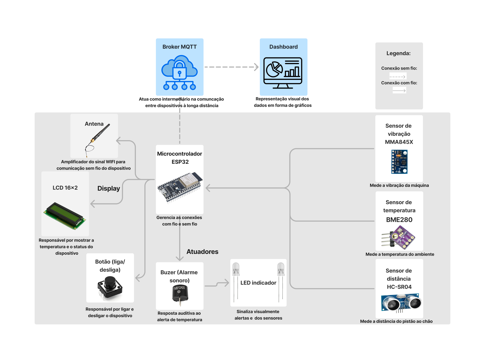  
Fonte: Material produzido pelos autores (2024)

#### Descrição Detalhada da Arquitetura Técnica da Solução

&nbsp;&nbsp;&nbsp;&nbsp;A seguir, detalhamos os componentes da solução, suas funções e como eles atendem aos requisitos funcionais e não funcionais:

##### 1. Microcontrolador

&nbsp;&nbsp;&nbsp;&nbsp;O ESP32 é o núcleo do sistema, processando dados coletados pelos sensores e gerenciando a comunicação com os atuadores e o dashboard através do protocolo MQTT. Sua conectividade Wi-Fi integrada garante a transmissão de dados em tempo real.

&nbsp;&nbsp;&nbsp;&nbsp;Justificativa: Atende aos requisitos funcionais de processamento e transmissão de dados, além de suportar escalabilidade para adição de novos sensores e eficiência ao reduzir componentes extras.

##### 2. Sensores

- O sensor de temperatura BME280 mede a temperatura do ambiente, ajudando a monitorar superaquecimentos.

&nbsp;&nbsp;&nbsp;&nbsp;Justificativa: Essencial para atender ao requisito funcional de coleta de dados críticos de temperatura e garantir confiabilidade ao sistema.

- O acelerômetro, aplicada a Transformada rápida de Fourier, detecta vibrações anômalas nos equipamentos, identificando falhas mecânicas.

&nbsp;&nbsp;&nbsp;&nbsp;Justificativa: Garante confiabilidade e proatividade no monitoramento de equipamentos, reduzindo possíveis paradas inesperadas.

- Sensor de Distância HC-SR04 mede a distância entre objetos e o solo para identificar deslocamentos do pistão da máquina.

&nbsp;&nbsp;&nbsp;&nbsp;Justificativa: Atende ao requisito de monitoramento preciso de componentes mecânicos, assegurando o bom funcionamento do sistema.

##### 3. Display

- O LCD 16x2 exibe informações em tempo real, como temperatura e status do sistema (Normal ou Alerta).

&nbsp;&nbsp;&nbsp;&nbsp;Justificativa: Proporciona acessibilidade e clareza ao operador, atendendo ao requisito de apresentação visual de dados críticos.

##### 4. Atuadores

- O Buzzer (Alarme Sonoro), emite alertas audíveis em situações críticas, como superaquecimento ou vibração excessiva.

&nbsp;&nbsp;&nbsp;&nbsp;Justificativa: Atende ao requisito de alertar o operador de forma imediata, aumentando a segurança e a confiabilidade do sistema.

- O LED Indicador sinaliza visualmente condições de alerta, permitindo rápida identificação de problemas.

&nbsp;&nbsp;&nbsp;&nbsp;Justificativa: Facilita o diagnóstico visual, atendendo ao requisito de alertas locais sem necessidade de interfaces adicionais.

##### 5. Comunicação e Interface

- O Broker MQTT responsável por gerenciar a comunicação entre o ESP32 e o dashboard, garantindo o envio e recebimento de mensagens de forma eficiente e segura.

&nbsp;&nbsp;&nbsp;&nbsp;Justificativa: Atende ao requisito funcional de comunicação sem fio confiável, assegurando integração entre os componentes.

- O dashboard IPTracker exibe os dados coletados em forma de gráficos, permitindo monitoramento em tempo real e análise de históricos.

&nbsp;&nbsp;&nbsp;&nbsp;Justificativa: Atende ao requisito funcional de visualização centralizada dos dados, garantindo uma interface intuitiva e acessível ao usuário.

##### 6. Ligações entre os elementos

- As conexões entre os componentes utilizam Wi-Fi para comunicação sem fio (ESP32, Broker MQTT e Dashboard) e cabeamento para os sensores, display e atuadores. Essa arquitetura assegura flexibilidade e eficiência no envio de dados.

&nbsp;&nbsp;&nbsp;&nbsp;Justificativa: O uso de conexões com fio para sensores e atuadores melhora a precisão e a confiabilidade, enquanto as conexões sem fio proporcionam escalabilidade e integração simplificada com a interface remota.

### 3.3.4. Arquitetura do Protótipo 

_Vídeo de explicação sobre a arquitetura do protótipo físico: ([https://youtu.be/E7RKe1nfZCc]())_

&nbsp;&nbsp;&nbsp;&nbsp;A seguir, apresentamos o diagrama da arquitetura técnica do protótipo desenvolvido para monitoramento de dados ambientais e operacionais em tempo real, detalhando os componentes do sistema, suas respectivas funções e as conexões que integram toda a solução.

Diagrama de arquitetura do protótipo do sistema Iot 
  
Fonte: Material produzido pelos autores (2024)

&nbsp;&nbsp;&nbsp;&nbsp;O sistema é centrado no microcontrolador ESP32, que processa os dados coletados por sensores e gerencia a comunicação com outros componentes. O ESP32 está conectado a três sensores principais: o BME280, que mede a temperatura do ambiente; o HC-SR04, que detecta distâncias de objetos próximos; e o MMA845X, que monitora vibrações, permitindo identificar anomalias em equipamentos. Esses sensores utilizam os protocolos I2C e GPIO para se comunicar eficientemente com o ESP32.

&nbsp;&nbsp;&nbsp;&nbsp;Além disso, o protótipo possui um display LCD 16x2, que apresenta informações importantes diretamente no dispositivo, como temperatura ambiente, estado do sistema e mensagens de alerta. Atuadores, como LEDs e buzzer, fornecem feedback visual e sonoro ao usuário, indicando o status do sistema e condições críticas. Dois botões físicos permitem ao usuário interagir diretamente com o protótipo, possibilitando ligar ou desligar o dispositivo e desativar alertas visuais e sonoros.

&nbsp;&nbsp;&nbsp;&nbsp;A comunicação entre os componentes do sistema utiliza uma combinação de protocolos com fio e sem fio. Internamente, os sensores e o display se conectam ao ESP32 por meio de I2C (usado para o BME280, MMA845X e LCD) e GPIO (usado para o HC-SR04, LEDs, buzzer e botões). Externamente, a comunicação sem fio ocorre via Wi-Fi, utilizando o protocolo MQTT para gerenciar a troca de mensagens entre o ESP32, o broker HiveMQ e o restante do sistema.

&nbsp;&nbsp;&nbsp;&nbsp;O protocolo MQTT, conhecido por sua eficiência em aplicações IoT, permite que o ESP32 publique dados dos sensores no broker HiveMQ. O broker atua como um intermediário, distribuindo esses dados para o banco de dados, hospedado no Render, e para o dashboard React. Esse fluxo de comunicação é bidirecional, permitindo que o usuário envie comandos para o ESP32 pelo dashboard, como ajustar configurações ou desligar alarmes.

&nbsp;&nbsp;&nbsp;&nbsp;O fluxo de dados no sistema segue uma lógica clara e estruturada. Os sensores coletam informações do ambiente, que são enviadas ao ESP32 para processamento. Esses dados são então transmitidos ao broker MQTT via Wi-Fi, onde são armazenados no banco de dados para consulta posterior ou enviados diretamente ao dashboard para exibição em tempo real. O dashboard também pode enviar comandos ao ESP32 por meio do broker, criando um ciclo contínuo de comunicação e controle.

&nbsp;&nbsp;&nbsp;&nbsp;As conexões são representadas no diagrama por linhas contínuas para conexões com fio (como I2C e GPIO) e linhas tracejadas para conexões sem fio (como Wi-Fi). Esse modelo garante que todos os fluxos de dados, desde a coleta até o armazenamento e a exibição, estejam claramente definidos e organizados.

&nbsp;&nbsp;&nbsp;&nbsp;As ferramentas utilizadas no desenvolvimento foram essenciais para garantir a funcionalidade do protótipo. A IDE Arduino foi empregada para programar o ESP32 em C++, possibilitando um controle preciso dos sensores, atuadores e comunicação. O React foi escolhido para criar um dashboard interativo e responsivo, enquanto o Express.js atuou como middleware, facilitando a integração entre o banco de dados e o dashboard. Antes da implementação física, o protótipo foi simulado na plataforma Wokwi, garantindo confiabilidade e desempenho.

&nbsp;&nbsp;&nbsp;&nbsp;A arquitetura do protótipo foi projetada para ser eficiente, integrada e de fácil uso, permitindo que os dados coletados pelos sensores sejam processados, armazenados e visualizados de maneira confiável. Cada componente desempenha um papel fundamental na solução, desde os sensores e atuadores conectados ao ESP32 até o dashboard que interage com o banco de dados no Render. O uso de protocolos claros, como MQTT, I2C e GPIO, garante a interoperabilidade e a comunicação eficiente entre os elementos.

| **Componente**             | **Descrição**                                                                                | **Tipo**          |
| -------------------------- | -------------------------------------------------------------------------------------------- | ----------------- |
| ESP32                      | Microcontrolador que coleta dados dos sensores e gerencia a comunicação via Wi-Fi.           | Microcontrolador  |
| Sensor BME280              | Mede temperatura e umidade com alta precisão. Comunicação via I2C.                           | Sensor            |
| Sensor HC-SR04             | Mede distâncias de 2 cm a 4 m utilizando sinais ultrassônicos. Comunicação via GPIO.         | Sensor            |
| Sensor de Vibração MMA845X | Mede vibrações da máquina em funcionamento. Comunicação via I2C.                             | Sensor            |
| Display LCD 16x2           | Exibe informações como temperatura, distância e alertas do sistema. Comunicação via I2C.     | Display           |
| LEDs                       | Indicadores visuais para status (verde para normal, vermelho para alertas).                  | Atuador           |
| Buzzer                     | Emite alertas sonoros em caso de condições críticas, como superaquecimento ou vibração alta. | Atuador           |
| Botão Liga/Desliga         | Liga e desliga o dispositivo, permitindo controle manual do sistema.                         | Componente Físico |
| Botão Desliga Alertas      | Desliga alertas sonoros e visuais, permitindo controle manual em situações críticas.         | Componente Físico |
| Antena Wi-Fi               | Amplifica o sinal sem fio para comunicação eficiente do ESP32 com o broker MQTT.             | Comunicação       |

### 3.3.5. Arquitetura Refinada da Solução 

&nbsp;&nbsp;&nbsp;&nbsp;A arquitetura refinada da solução IoT foi elaborada com base nos resultados dos testes, feedbacks dos usuários e validações técnicas realizadas durante o desenvolvimento do protótipo inicial. Essa revisão teve como foco aprimorar a integração entre os componentes físicos e o software, garantir maior robustez e atender aos **requisitos funcionais** e **não funcionais** estabelecidos.

---

#### **Visão Geral da Arquitetura Revisada**

A arquitetura revisada é composta pelos seguintes componentes principais:

1. **Microcontrolador ESP32**  
   O ESP32 continua como o núcleo central do sistema, responsável pela coleta, processamento e envio dos dados. O microcontrolador processa as entradas dos sensores e envia os resultados para o broker MQTT através de Wi-Fi.  
   - **Ajuste:** Implementação de um watchdog timer para garantir que o sistema reinicie automaticamente em caso de falha crítica, atendendo ao requisito **RNF02** (disponibilidade de 95%).

2. **Sensores de Coleta de Dados**  
   - **Sensor BME280:** Monitora a temperatura e umidade ambiente com alta precisão.  
   - **Sensor de Vibração MMA845X:** Mede oscilações e movimentos para identificar problemas mecânicos nos equipamentos.  
   - **Sensor Ultrassônico HC-SR04:** Monitora deslocamento de partes móveis.  
   - **Ajuste:** Revisão da calibração dos sensores para minimizar o erro de leitura e garantir maior precisão (**RNF03**: segurança e confiabilidade).  

3. **Interface com Usuário (Dashboard React.js)**  
   O dashboard fornece visualização em tempo real dos dados coletados e gráficos históricos para análise preditiva de manutenção.  
   - **Ajuste:** Implementação de novos filtros no dashboard para que o usuário consiga visualizar apenas os dados críticos de equipamentos específicos, alinhando-se ao requisito **RF07** (representação gráfica).  

4. **Atuadores**  
   - **LEDs Indicadores:**  
     - **Verde:** Sistema funcionando normalmente.  
     - **Vermelho:** Alerta crítico detectado.  
   - **Buzzer:** Alerta sonoro em caso de condição crítica.  
   - **Ajuste:** Configuração do tempo de ativação do buzzer para evitar alertas redundantes, melhorando a experiência do usuário (**RNF04**: usabilidade).  

5. **Comunicação via MQTT**  
   O protocolo MQTT foi mantido como a base de comunicação entre o ESP32 e o broker HiveMQ devido à sua eficiência em ambientes com recursos limitados.  
   - **Ajuste:** Implementação de uma política de reconexão automática caso a comunicação com o broker seja interrompida (**RNF02**: disponibilidade).  

6. **Banco de Dados no Render**  
   Os dados coletados são armazenados em um banco de dados hospedado no **Render** para posterior análise.  
   - **Ajuste:** Implementação de um mecanismo de armazenamento otimizado para manter o histórico de até **2 anos**, atendendo ao requisito **RNF05** (histórico de dados).  

7. **LCD 16x2**  
   Exibe as informações essenciais em tempo real, como temperatura, alertas e status do sistema.  
   - **Ajuste:** Melhoria nas mensagens exibidas no LCD, garantindo clareza e precisão em situações de alerta.

---

#### **Fluxo de Dados e Comunicação**

A nova arquitetura mantém um fluxo de dados claro e estruturado:

1. **Sensores** → Leitura dos dados ambientais e operacionais (temperatura, vibração e distância).  
2. **Microcontrolador ESP32** → Processamento dos dados e envio ao broker MQTT via Wi-Fi.  
3. **Broker MQTT (HiveMQ)** → Distribuição dos dados coletados entre os dispositivos e o banco de dados.  
4. **Banco de Dados (Render)** → Armazena os dados históricos para análises preditivas.  
5. **Dashboard (React.js)** → Visualização dos dados em tempo real e interação com os usuários.  
6. **Atuadores** → Ativação de LEDs e buzzer em resposta a condições críticas.

---

#### **Justificativa dos Ajustes com Requisitos**

- **RNF01 (Desempenho):** Redução no tempo de resposta do sistema ao otimizar a leitura dos sensores e a transmissão via MQTT.  
- **RNF02 (Disponibilidade):** Implementação do watchdog timer e reconexão automática com o broker MQTT para garantir funcionamento contínuo.  
- **RNF03 (Segurança):** Uso de criptografia na comunicação MQTT e validação da calibração dos sensores.  
- **RNF04 (Usabilidade):** Melhorias no dashboard e ajuste dos alertas sonoros para evitar notificações desnecessárias.  
- **RNF05 (Histórico):** Armazenamento eficiente dos dados para análise histórica de até **2 anos**.  
- **RNF06 (Robustez):** Garantia de resistência física do hardware em ambientes industriais (resistência à poeira e umidade).

---

### **Conclusão**

A arquitetura refinada aborda de forma eficaz os pontos identificados no desenvolvimento inicial, proporcionando um sistema robusto, eficiente e alinhado com os requisitos do IPT. Os ajustes implementados garantem melhor desempenho, maior confiabilidade e uma experiência aprimorada para os usuários finais. O sistema agora está preparado para funcionar em ambientes reais, oferecendo monitoramento contínuo e análises preditivas para otimização dos processos de manutenção.

## 3.4. Resultados 

&nbsp;&nbsp;&nbsp;&nbsp;Nesta seção, serão apresentados os principais resultados obtidos ao longo do desenvolvimento do projeto, evidenciando as etapas de construção e evolução dos protótipos. Começaremos pelo protótipo inicial criado no simulador Wokwi, que permitiu validar conceitos e testar funcionalidades em um ambiente virtual. Em seguida, destacaremos o desenvolvimento do protótipo físico offline, que trouxe o projeto para o mundo real, com componentes tangíveis e operacionais. Por fim, exploraremos o protótipo final, integrado com os protocolos MQTT e I2C, representando o estágio mais avançado do projeto, com comunicação eficiente e conectividade aprimorada.

### 3.4.1. Protótipo Inicial do Projeto usando o Simulador Wokwi 

&nbsp;&nbsp;&nbsp;&nbsp;O protótipo inicial do projeto é composto por 2 LEDs (um verde e um vermelho), um sensor de temperatura (BME280), um push button, uma placa de LCD 16x2 e um buzzer. Esse protótipo funcina da seguinte maneira:

1. O sistema fica inicialmente desligado, com a mensagem "sistema desligado" apresentada na placa de LCD, sendo ativado quando o push button pe apertado;

2. Enquanto ligado, sistema fica com o LED verde ligado, indicando seu estado de atividade;

3. Se a temperatura ambiente for menor ou igual a 25°C, o a placa LCD apresenta essa temperatura na primeira linha, e a mensagem "temperatura normal" na linha abaixo. Nesse caso, o LED vermelho fica desligado, enquanto o verde permanece ligado;

4. No momento em que a temperatura ultrapasse os 25°C, o sistema dispara um alarme por meio do buzzer, acende o LED vermelho e, na segunda linha da placa de LCD, sinaliza a mensagem "Alerta: Temp. alta".

&nbsp;&nbsp;&nbsp;&nbsp;O circuito utilizado para esse protótipo encontra-se na imagem abaixo, e seu código pode ser encontrado no arquivo <code>prototipo01.ino</code>, disponível na pasta <code>src</code> deste repositório.
 

Figura 9 - Circuito do primeiro protótipo 
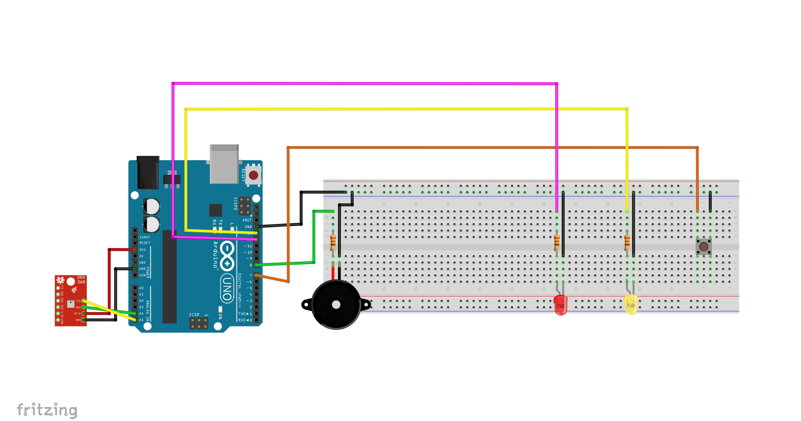 
Fonte: Material produzido pelos autores (2024)

 

- O funcionamento desse protótipo fisico pode ser acessado clicando [aqui](https://youtu.be/s-TSx-r5Cmw).
- A prototipagem do circuito pode ser acessada [aqui](https://wokwi.com/projects/412486777396014081). Entretanto, este link leva ao Wokwi, plataforma de prototipagem que não diponibiliza o BME280, então o protótipo do link utiliza o sensor DHT22.\*

\*O protótipo com o sensor correto foi realizado na plataforma fritizing, a qual, infelizmente, não disponibiliza o link do protótipo de forma gratuita, mas ele pode ser visualizado na figura 9 - Circuito do primeiro protótipo.

&nbsp;&nbsp;&nbsp;&nbsp;A fim de testar a funcionalidade do protótipo acima, foram desenvolvidos os casos de teste abaixo, que consideram os componentes de entrada e saída, com suas respectivas leituras.

| **#** | **Bloco**                          | **Pré-condição**   | **Componente de entrada**    | **Leitura da entrada**         | **Componente de saída**              | **Leitura da saída**                                          | **Descrição**                                                                                                                                             |
| ----- | ---------------------------------- | ------------------ | ---------------------------- | ------------------------------ | ------------------------------------ | ------------------------------------------------------------- | --------------------------------------------------------------------------------------------------------------------------------------------------------- |
| 01    | Sistema de controle de temperatura | Dispositivo ligado | Apertar botão                | Pressionado                    | LED indicador de ligado              | Aceso                                                         | O sistema é ligado quando o botão é pressionado pela primeira vez.                                                                                        |
| 02    | Sistema de controle de temperatura | Dispositivo ligado | Sensor de temperatura BME280 | 8°C                            | LCD                                  | "Temp: 8 C" e "Temp Normal"                                   | O LCD exibe a temperatura e a mensagem de "Temp Normal" quando a temperatura está abaixo de 10°C.                                                         |
| 03    | Sistema de controle de temperatura | Dispositivo ligado | Sensor de temperatura BME280 | 12°C                           | LCD e Buzzer                         | "Temp: 12 C" e "ALERTA: Temp Alta", buzzer ativado            | O LCD exibe a temperatura e a mensagem de alerta, e o buzzer é acionado quando a temperatura está acima de 10°C.                                          |
| 04    | Sistema de controle de temperatura | Dispositivo ligado | Sensor de temperatura BME280 | 8°C (após estar acima de 10°C) | LCD e Buzzer                         | "Temp: 8 C" e "Temp Normal", buzzer desativado                | O LCD exibe a temperatura e a mensagem de "Temp Normal", e o buzzer é desativado quando a temperatura cai para abaixo de 10°C.                            |
| 05    | Sistema de controle de temperatura | Dispositivo ligado | Apertar botão                | Pressionado                    | LED indicador de ligado, LCD, Buzzer | LED apagado, LCD apagado, buzzer desativado                   | O sistema é desligado quando o botão é pressionado novamente. O LCD, buzzer e LEDs são desligados.                                                        |
| 06    | Sistema de controle de temperatura | Dispositivo ligado | Sensor de temperatura BME280 | 11°C (subindo)                 | LCD, Buzzer, LED de temperatura alta | "Temp: 11 C" e "ALERTA: Temp Alta", buzzer ativado, LED aceso | O LCD exibe a temperatura e a mensagem de alerta, o buzzer é acionado e o LED de temperatura alta acende quando a temperatura ultrapassa 10°C.            |
| 07    | Sistema de controle de temperatura | Dispositivo ligado | Sensor de temperatura BME280 | 9°C (descendo)                 | LCD, Buzzer, LED de temperatura alta | "Temp: 9 C" e "Temp Normal", buzzer desativado, LED apagado   | O LCD exibe a temperatura e a mensagem de "Temp Normal", o buzzer é desativado e o LED de temperatura alta apaga quando a temperatura cai abaixo de 10°C. |

&nbsp;&nbsp;&nbsp;&nbsp;Após a realização dos testes, pôde-se observar que o prótipo passou por todos eles, demostrando que seu cirucuito está corretamente montado e conectado ao código.

### 3.4.2. Protótipo Físico do Projeto (offline) 

&nbsp;&nbsp;&nbsp;&nbsp;Para garantir o correto funcionamento do protótipo, é fundamental realizar testes abrangentes que simulem diversas condições de operação. Esses testes não devem apenas verificar a resposta do sistema em situações ideais, mas também considerar possíveis falhas que possam ocorrer durante o uso real. Para uma visão prática do funcionamento do protótipo, acesse o vídeo [demonstrativo](https://youtu.be/jhpm7OQ4QIc).

 

Figura 10 - Protótipo Offline 
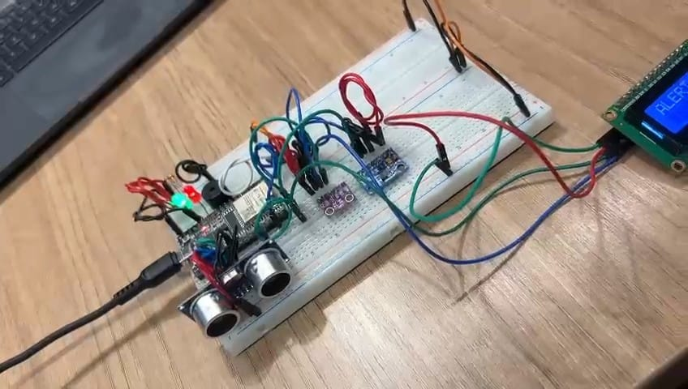 
Fonte: Material produzido pelos autores (2024)

 

&nbsp;&nbsp;&nbsp;&nbsp;Na tabela a seguir, são apresentados cenários representativos com diferentes combinações de entradas e saídas, abrangendo tanto situações de sucesso quanto falhas. Cada teste foi cuidadosamente desenhado para avaliar o desempenho dos sensores, atuadores e a interação do usuário com o sistema, além de garantir que as funcionalidades atendam aos requisitos técnicos e de experiência do usuário. Além disso, foram considerados aspectos como o alinhamento com o comportamento esperado dos dispositivos e as mensagens fornecidas em casos de erro.

| **#** | **Bloco**                              | **Pré-condição**                   | **Componente de entrada**           | **Leitura da entrada**                      | **Componente de saída**              | **Leitura da saída**                                          | **Descrição**                                                                                                                          |
| ----- | -------------------------------------- | ---------------------------------- | ----------------------------------- | ------------------------------------------- | ------------------------------------ | ------------------------------------------------------------- | -------------------------------------------------------------------------------------------------------------------------------------- |
| 01    | Sistema de inicialização               | Dispositivo desligado              | Apertar botão                       | Pressionado                                 | LED amarelo indicador de ligado      | Aceso                                                         | O sistema é ligado quando o botão é pressionado pela primeira vez.                                                                     |
| 02    | Sistema de controle de temperatura     | Dispositivo ligado                 | Sensor de temperatura BME280        | 20°C                                        | Monitor Serial, LCD                  | "Temp: 20°C" e "Temp Normal"                                  | Exibe a temperatura e a mensagem "Temp Normal" quando a temperatura está abaixo de 25°C.                                               |
| 03    | Sistema de controle de temperatura     | Dispositivo ligado                 | Sensor de temperatura BME280        | 35°C                                        | LED vermelho, Buzzer, LCD            | LED aceso, buzzer ativado, "Temp: 35°C" e "ALERTA: Temp Alta" | Quando a temperatura ultrapassa 27°C, o LCD exibe alerta, o buzzer e o LED de temperatura alta são ativados.                           |
| 04    | Sistema de controle de temperatura     | Dispositivo ligado                 | Apertar botão                       | Pressionado                                 | LED indicador de ligado, LCD, Buzzer | LED apagado, LCD apagado, buzzer desativado                   | O sistema é desligado quando o botão é pressionado novamente. Todos os componentes são desativados.                                    |
| 05    | Sistema de controle de temperatura     | Dispositivo ligado                 | Sensor de temperatura BME280        | 26°C (subindo)                              | LCD, Buzzer, LED de temperatura alta | "Temp: 26°C" e "ALERTA: Temp Alta", buzzer ativado, LED aceso | Quando a temperatura ultrapassa 25°C, o sistema exibe alerta, ativa o buzzer e acende o LED de temperatura alta.                       |
| 06    | Sistema de controle de temperatura     | Dispositivo ligado                 | Sensor de temperatura BME280        | 24°C (descendo)                             | LCD, Buzzer, LED de temperatura alta | "Temp: 24°C" e "Temp Normal", buzzer desativado, LED apagado  | Ao descer abaixo de 25°C, a mensagem "Temp Normal" é exibida, o buzzer e o LED são desativados.                                        |
| 07    | Sistema de controle de distância       | Dispositivo ligado                 | Sensor ultrassônico HC-SR04         | Objeto a 50 cm                              | Monitor Serial                       | "Distância: 50 cm"                                            | Exibe a distância medida pelo sensor ultrassônico em cm.                                                                               |
| 08    | Sistema de controle de distância       | Dispositivo ligado                 | Sensor ultrassônico HC-SR04         | Objeto fora do alcance                      | Monitor Serial                       | "Erro: fora de alcance"                                       | Exibe uma mensagem de erro quando o objeto está fora do alcance do sensor.                                                             |
| 09    | Sistema de monitoramento de aceleração | Dispositivo ligado                 | Sensor de aceleração MMA845X        | Acelerômetro (X: 1.5, Y: 0.5, Z: -0.2 m/s²) | Monitor Serial                       | "Aceleração - X: 1.5 Y: 0.5 Z: -0.2 m/s²"                     | Exibe as leituras de aceleração em cada eixo (X, Y, Z) no monitor serial.                                                              |
| 10    | Sistema de monitoramento de aceleração | Dispositivo ligado                 | Sensor de aceleração MMA845X        | Falha de leitura                            | Monitor Serial, LCD                  | "Erro: MMA845X não conectado"                                 | Exibe uma mensagem de erro quando o sensor de aceleração não está conectado.                                                           |
| 11    | Sistema de controle de temperatura     | Sensor de temperatura desconectado | Tentativa de leitura de temperatura | -                                           | Monitor Serial, LCD                  | "Erro na leitura"                                             | Exibe "Erro na leitura" quando o sensor BME280 está desconectado ou com falha.                                                         |
| 12    | Sistema de controle de distância       | Dispositivo ligado                 | Sensor ultrassônico HC-SR04         | Objeto a 10 cm                              | Monitor Serial, LCD                  | "Distância: 10 cm"                                            | Quando o objeto está próximo, o sistema exibe a distância e ajusta os alarmes conforme necessário.                                     |
| 13    | Sistema de controle de distância       | Dispositivo ligado                 | Sensor ultrassônico HC-SR04         | Objeto a 200 cm                             | Monitor Serial                       | "Distância: 200 cm"                                           | Exibe corretamente a distância medida em centímetros, com precisão para objetos distantes.                                             |
| 14    | Sistema de controle de distância       | Dispositivo ligado                 | Sensor ultrassônico HC-SR04         | Objeto a 0 cm                               | Monitor Serial, LCD                  | "Distância: 0 cm"                                             | Verifica se o sensor registra uma distância de 0 cm quando o objeto está em contato direto com o sensor.                               |
| 15    | Sistema de controle de distância       | Dispositivo ligado                 | Sensor ultrassônico HC-SR04         | Objeto muito próximo (< 2 cm)               | Monitor Serial                       | "Erro: Distância inválida"                                    | Verifica se o sensor emite uma mensagem de erro quando a distância medida está fora do intervalo válido (menor que 2 cm).              |
| 16    | Sistema de controle de distância       | Dispositivo ligado                 | Sensor ultrassônico HC-SR04         | Vários objetos a diferentes distâncias      | Monitor Serial                       | "Distância: 30 cm", "Distância: 100 cm", "Distância: 150 cm"  | Verifica se o sensor consegue detectar corretamente várias distâncias em sequência com diferentes objetos posicionados na frente dele. |
| 17    | Sistema de monitoramento de aceleração | Dispositivo ligado                 | Sensor de aceleração MMA845X        | Acelerômetro com movimento brusco           | Monitor Serial                       | "Aceleração - X: 3.0 Y: 2.5 Z: 9.8 m/s²"                      | Testa a resposta do sensor a um movimento brusco, verificando se ele capta mudanças rápidas nos eixos.                                 |
| 18    | Sistema de monitoramento de aceleração | Dispositivo ligado                 | Sensor de aceleração MMA845X        | Acelerômetro em repouso                     | Monitor Serial                       | "Aceleração - X: 0.0 Y: 0.0 Z: 9.8 m/s²"                      | Verifica se o sensor fornece a aceleração correta quando o dispositivo está em repouso (gravitacionalmente, Z = 9.8 m/s²).             |
| 19    | Sistema de monitoramento de aceleração | Dispositivo ligado                 | Sensor de aceleração MMA845X        | Acelerômetro em movimento linear            | Monitor Serial                       | "Aceleração - X: 2.0 Y: 0.0 Z: 0.0 m/s²"                      | Testa se o sensor pode medir acelerações lineares (movimento em uma direção específica) e mostrar a aceleração nos eixos corretos.     |

 

Figura 11 - Protótipo Offline Alerta de Temperatura 
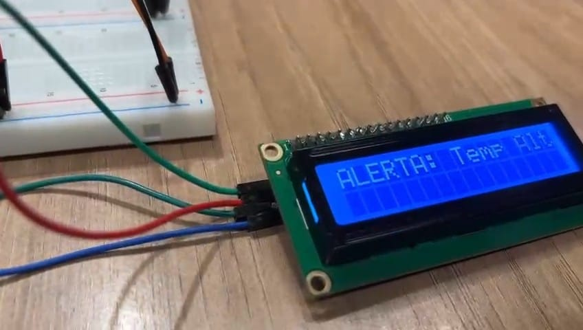 
Fonte: Material produzido pelos autores (2024)

 

&nbsp;&nbsp;&nbsp;&nbsp;Na figura acima, o protótipo está configurado para sinalizar alertas de temperatura. Este estado do sistema é alcançado quando a temperatura detectada ultrapassa o limite seguro, ativando automaticamente o LED vermelho e o buzzer para alertar o usuário sobre o risco.

 

Figura 11 - Protótipo Offline Sensores 
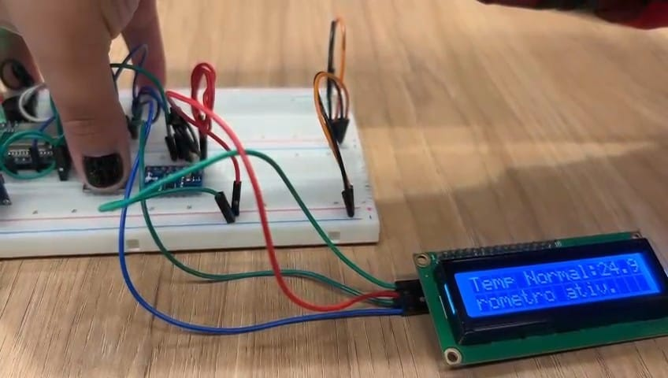 
Fonte: Material produzido pelos autores (2024)

 

&nbsp;&nbsp;&nbsp;&nbsp;Os resultados dos testes apresentados são importantes para validar o protótipo, realizar ajustes nos componentes e garantir que o sistema opere corretamente, mesmo em cenários inesperados. A tabela detalha os testes realizados, incluindo exemplos de leituras e respostas para cada situação, tanto em casos de sucesso quanto em possíveis falhas. Esses registros fornecem informações relevantes para futuros ajustes, auxiliando na melhoria do sistema, de forma a torná-lo mais alinhado aos requisitos de uso de maneira segura.

### 3.4.3. Protótipo do Projeto com MQTT e I2C 

&nbsp;&nbsp;&nbsp;&nbsp;O protocolo **I2C** foi utilizado no projeto para a comunicação entre o microcontrolador e os sensores conectados ao sistema. Através do I2C, foi possível integrar múltiplos dispositivos de forma eficiente para troca de dados e controle. Esse protocolo permite a comunicação sincronizada entre os sensores e o microcontrolador, facilitando a leitura de dados, como temperatura e vibração, e otimizando o uso dos pinos do microcontrolador.

 

Figura 12 - Protótipo 
 
Fonte: Material produzido pelos autores (2024)

 

&nbsp;&nbsp;&nbsp;&nbsp;Ainda com base nesse protótipo são apresentados a seguir os principais cenários de uso relacionados ao funcionamento do sistema com o ESP32, abrangendo desde a interação do usuário com a interface até situações de erro e notificações críticas. Cada caso foi descrito com base em diferentes estados do ambiente, ações realizadas pelo usuário e as respostas esperadas do sistema, visando garantir uma operação eficiente, segura e alinhada com as necessidades do projeto. Este mapeamento de cenários serve como guia para testes e futuras melhorias, proporcionando uma visão clara das interações entre hardware, software e usuários.

&nbsp;&nbsp;&nbsp;&nbsp;Para mais informações sobre o protótipo, a arquitetura da solução e o condicionador de sinais, assista ao vídeo disponível neste [link](https://youtu.be/w5m2fXz0pfk).

| **#** | **Configuração do ambiente**                                  | **Ação do usuário**                                            | **Resposta esperada do sistema**                                                                                                                                            |
| ----- | ------------------------------------------------------------- | -------------------------------------------------------------- | --------------------------------------------------------------------------------------------------------------------------------------------------------------------------- |
| 01    | ESP32 conectado ao Wi-Fi                                      | Acessa a plataforma                                            | Interface retorna os valores e o horário de última atualização do equipamento X                                                                                             |
| 02    | ESP32 não conectado ao Wi-Fi                                  | Usuário tenta acessar dados de sensores ou reconfigurá-los     | Mensagem de erro exibida: "Conexão ao Wi-Fi indisponível. Verifique e tente novamente."                                                                                     |
| 03    | ESP32 conectado ao broker HiveMQ                              | Usuário configura o funcionamento via interface                | Sistema atualiza os limites nos sensores e confirma a configuração com mensagem de sucesso                                                                                  |
| 04    | ESP32 não conectado ao broker HiveMQ                          | Usuário tenta gerar uma nova configuração                      | Mensagem de erro exibida: "Conexão com o broker perdida. Reconectando..."                                                                                                   |
| 05    | Sensores configurados pela interface                          | Usuário cria uma nova configuração                             | Sistema exibe "Sensor X ativado com sucesso" e registra leituras no dashboard                                                                                               |
| 06    | Sensores não configurados pela interface                      | Usuário tenta ativar o sistema para um novo equipamento        | Mensagem de erro exibida: "Sensores não configurado. Por favor, configure-o antes de ativar."                                                                               |
| 07    | Erro ao adicionar nova configuração de dispositivo            | Usuário tenta adicionar um novo dispositivo                    | Mensagem de erro exibida: "Erro ao adicionar um novo dispositivo."                                                                                                          |
| 08    | Visualização dos dados ocorrendo corretamente                 | Usuário acessa o dashboard de leituras de sensores             | Sistema apresenta gráficos atualizados em tempo real com os dados capturados                                                                                                |
| 09    | Visualização dos dados ocorrendo com falhas                   | Usuário acessa o dashboard, mas um sensor não responde         | Sistema apresenta mensagem: "Erro ao obter dados do sensor de temperatura. Verifique a conexão."                                                                            |
| 10    | Protótipo liga/desliga                                        | Usuário pressiona o botão de ligar o protótipo                 | Sistema ativa todos os componentes, exibe status "Sistema ligado" no LCD, led liga e inicia os sensores                                                                     |
| 11    | Protótipo com erro ao ligar/desligar                          | Usuário tenta ligar, mas falha ocorre                          | Led mantem-se desligado e sensores iniciam                                                                                                                                  |
| 12    | Todos os sensores conectados e operacionais                   | Usuário monitora o tempo de uso e as oscilações de cada sensor | Sistema apresenta leituras consistentes e alerta ao atingir tempo para manutenção                                                                                           |
| 13    | Sensor de vibração configurado para monitorar o tempo de uso  | Tempo de uso atinge limite de manutenção                       | Sistema exibe alerta com led e buzzer e interface envia notificação "Atenção: Tempo de uso excedido. Recomenda-se troca de óleo."                                           |
| 14    | Sensor de distância configurado para monitorar o tempo de uso | Distância percorrida indica limite de manutenção               | Alerta exibido: "Atenção: Distância limite alcançada. Verifique o óleo."                                                                                                    |
| 15    | Temperatura extrapola limite definido                         | Temperatura capturada ultrapassa o valor configurado           | Sistema exibe alerta com led e buzzer e envia notificação ao usuário pela interface: "Alerta: Temperatura acima do limite definido. Verifique o equipamento imediatamente." |

&nbsp;&nbsp;&nbsp;&nbsp;Os testes realizados foram fundamentados nas condições detalhadas na tabela acima, que especifica as configurações do ambiente, ações esperadas dos usuários e respostas ideais do sistema. A partir dessas condições, os resultados dos testes foram analisados, cobrindo aspectos como exibição de informações no visor LCD, notificações no front-end, visualização de gráficos e funcionamento da comunicação MQTT, garantindo que o sistema atenda aos objetivos propostos.

**Visor do LCD**

- Exibição da Temperatura: Em relação à verificação da exibição da temperatura via LCD, constatou-se a apresentação da leitura correta da temperatura captada pelos sensores. Durante o teste, valores simulados foram enviados para garantir que o visor atualizasse em tempo real.

 

Figura 13 - LCD Temperatura 
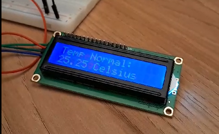 
Fonte: Material produzido pelos autores (2024)

 

- Mensagem Estado do Sistema: Outra funcionalidade avaliada foi a exibição do estado do sistema. Quando desligado, o visor do LCD exibia corretamente a mensagem "Sistema Desligado", indicando que os componentes estavam inativos.

 

Figura 14 - LCD Estado do Sistema 
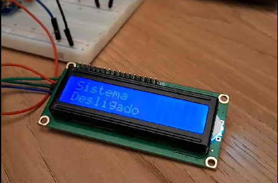 
Fonte: Material produzido pelos autores (2024)

 

**Front-End**

- Gráficos em Tempo Real: Durante o teste, foi evidenciado que o front-end esta devidamente preparado para oferecer a visualização dos gráficos baseados nos dados capturados pelos sensores, permitindo a personalização da visualização de acordo com o sensor e o período.

 

Figura 15 - Interface Gráficos 
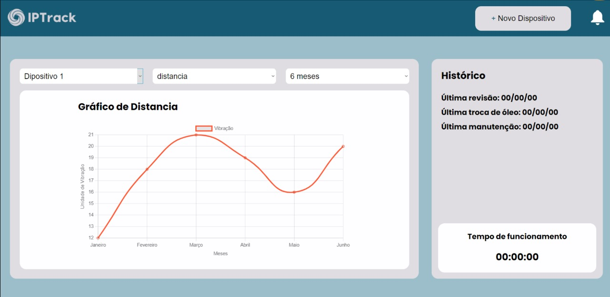 
Fonte: Material produzido pelos autores (2024)

 

- Notificações: Situações específicas, como temperaturas acima do limite, haverá a geração de notificações. O front-end apresenta espaço correto para a exibição de alertas conforme esperado, o que garantirá a comunicação com o usuário.

 

Figura 16 - Interface Notificações 
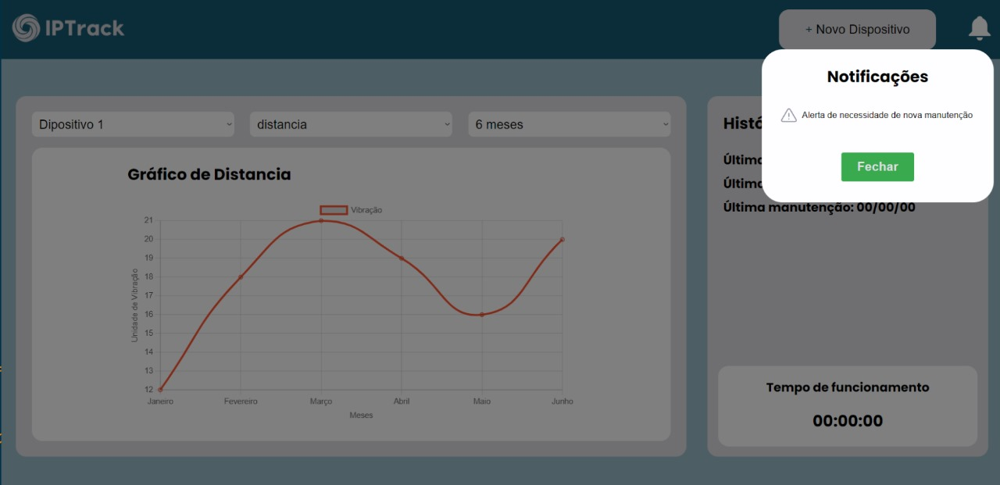 
Fonte: Material produzido pelos autores (2024)

 

- Configuração: Para personalizar o funcionamento do dispositivo com base nas necessidades de cada equipamento, tem-se, como necessário, os campos para preenchimento das configurações de distância máxima e indicador de funcionamento, por exemplo.

 

Figura 17 - Interface Configuração 
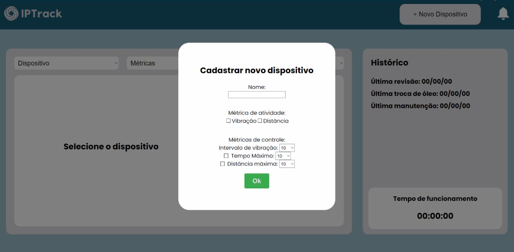 
Fonte: Material produzido pelos autores (2024)

 

**Conexão Wi-fi e Broker MQTT**

&nbsp;&nbsp;&nbsp;&nbsp;Para proporcionar uma melhor interação com o usuário, é importante que o projeto esteja integrado à internet, o que possibilita uma interface dinâmica e atualizada em tempo real. Para isso, utiliza-se o protocolo MQTT, que permite a comunicação eficiente entre os dispositivos e a plataforma, garantindo que os dados dos sensores sejam transmitidos rapidamente e de forma confiável, mantendo o sistema sempre online.

- Conexão Bem-Sucedida com Wi-Fi e Broker: Durante os testes, foi validado que o ESP32 consegue se conectar corretamente ao Wi-Fi e ao broker HiveMQ. A conexão bem-sucedida é indicada na interface, garantindo a troca de dados com o broker de forma eficiente, e o sistema exibe a confirmação da conexão no visor LCD.

 

Figura 18 - Interface Configuração 
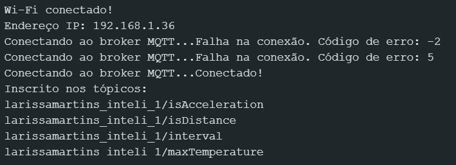 
Fonte: Material produzido pelos autores (2024)

 

- Falha na Conexão com o Broker: Quando o sistema falha na conexão com o broker, o monitor serial exibe uma mensagem de erro, informando que a conexão com o broker foi perdida ou não foi estabelecida. Esse erro impede a troca de dados entre o sistema e o broker HiveMQ.

 

Figura 19 - Interface Configuração 
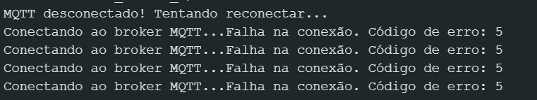 
Fonte: Material produzido pelos autores (2024)

 

- Falha na Conexão com o Wi-Fi: Em caso de falha na conexão com a rede Wi-Fi, o sistema exibe uma mensagem de erro no monitor serial. A falta de conexão impede que o sistema se conecte ao broker HiveMQ, comprometendo a transmissão dos dados dos sensores.

 

Figura 20 - Interface Configuração 
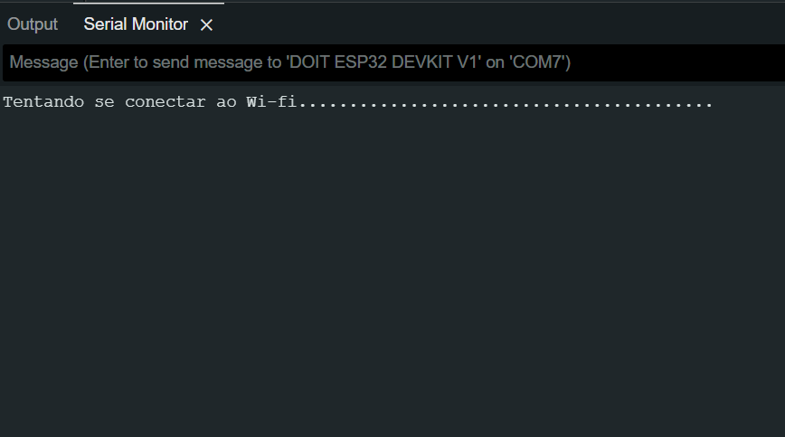 
Fonte: Material produzido pelos autores (2024)

 

**Serial Monitor e MQTT**

- Recebimento de Mensagens MQTT: Foi avaliada a capacidade do sistema de receber mensagens via MQTT com o HiveMQ. O monitor serial demonstrou que os dados enviados ao broker eram corretamente capturados pelo ESP32.

 

Figura 21 - MQTT Recebimento 
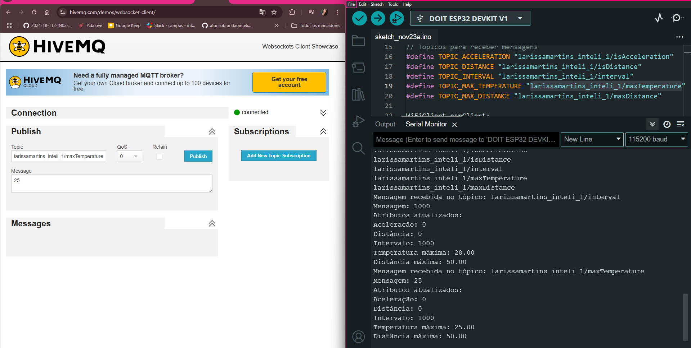 
Fonte: Material produzido pelos autores (2024)

 

- Envio de Mensagens MQTT: Por fim, o envio de mensagens do sistema para o broker HiveMQ foi testado. Tanto o monitor serial quanto o dashboard do HiveMQ exibiram os dados enviados, comprovando a confiabilidade do envio de informações e a integração bem-sucedida com o protocolo MQTT.

 

Figura 22 - MQTT Envio 
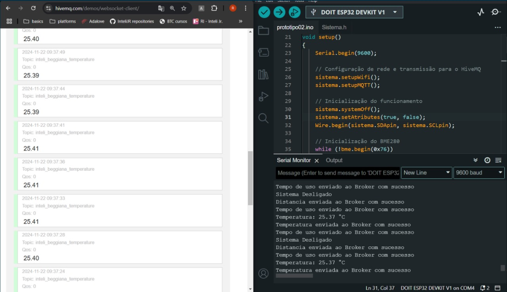 
Fonte: Material produzido pelos autores (2024)

 

&nbsp;&nbsp;&nbsp;&nbsp;Em suma, os testes realizados durante a Sprint 3 do projeto permitiram validar o funcionamento do sistema, especialmente em relação à conexão com o Wi-Fi e ao broker MQTT, bem como a exibição dos dados no visor LCD e no front-end. Com base nos cenários de uso descritos, foi possível verificar se o sistema responde adequadamente às ações dos usuários, incluindo a configuração de dispositivos, monitoramento de sensores e a comunicação de alertas. As funcionalidades foram testadas em diversas condições, abrangendo tanto os casos de sucesso quanto os de falha.

&nbsp;&nbsp;&nbsp;&nbsp;Os testes realizados foram fundamentais não apenas para verificar o que já está funcionando corretamente, mas também para identificar aspectos que ainda necessitam de ajustes ou que não estão 100% implementados. Embora o sistema tenha demonstrado boa performance em muitos cenários, alguns pontos ainda exigem aprimoramento. Esses testes proporcionaram uma ótima visão sobre as áreas que precisam de mais refinamento, ajudando a planejar as próximas etapas de desenvolvimento e implementação para garantir a estabilidade e a confiabilidade do sistema.

### 3.4.4. Protótipo Físico do Projeto (online) 

&nbsp;&nbsp;&nbsp;&nbsp;O protótipo físico do projeto, online, integra sensores e atuadores para o monitoramento e controle de maquinário, oferecendo uma interação entre os dispositivos físicos e a interface digital. O sistema foi projetado para fornecer dados em tempo real sobre o estado do equipamento, alertando o usuário sobre possíveis falhas e permitindo o controle remoto. Através de LEDs, buzzer, LCD e uma interface interativa, o protótipo assegura uma gestão eficiente e segura do maquinário conectado.

- **Led verde**: é um indicador visual que sinaliza que o sistema está ativo e em operação. Quando o maquinário está funcionando corretamente, o LED verde fica aceso, permitindo ao usuário saber que o dispositivo está ligado e monitorando os sensores. Ele é crucial para oferecer um feedback rápido e claro sobre o status operacional do sistema.

 

Figura 23 - Led verde 
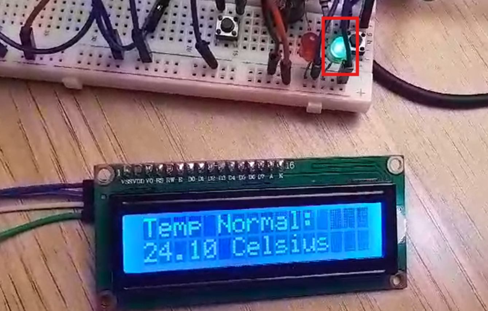 
Fonte: Material produzido pelos autores (2024)

 

- **Led vermelho**: é acionado quando o sistema detecta uma condição anômala nos sensores, entrando em estado de alarme. Esse LED sinaliza visualmente que algo não está conforme os parâmetros estabelecidos, como temperatura ou vibração fora dos limites críticos. Ele atua como um alerta imediato, ajudando o usuário a identificar problemas rapidamente e tomar ações corretivas antes de uma falha mais grave.

 

Figura 24 - Led vermelho 
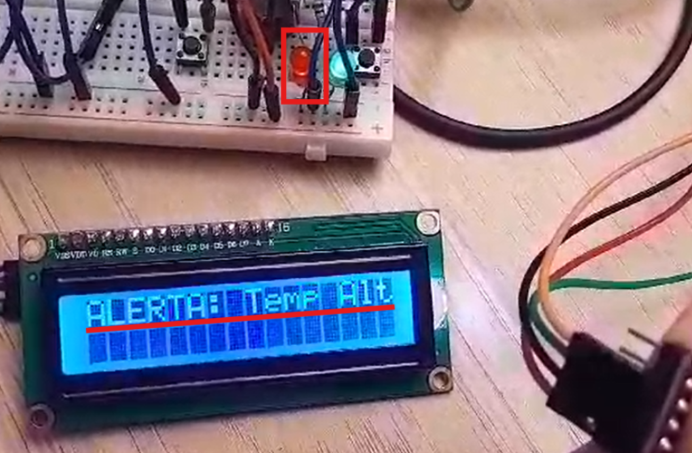 
Fonte: Material produzido pelos autores (2024)

 

- **Buzzer e notificação**: O buzzer é ativado simultaneamente com o LED vermelho para emitir um som de alerta sempre que o sistema entra em estado de alarme. Essa notificação sonora complementa o sinal visual, garantindo que o usuário perceba a situação com urgência. Além disso, o sistema também envia notificações digitais, como mensagens ou alertas visuais na interface, para informar ao usuário o motivo do alarme e o que precisa ser corrigido no sistema.

- **Botão liga/desliga**: é um dos componentes chave para o controle do sistema. Ao pressioná-lo, o usuário pode ativar ou desativar o dispositivo. Quando o sistema é ativado, o LED verde se acende, e o LCD começa a exibir as medições em tempo real. Esse botão é essencial para iniciar ou interromper o monitoramento dos sensores, permitindo um controle total sobre o funcionamento do maquinário.

- **Botão desativa alarme**: permite ao usuário desativar o estado de alarme no sistema. Quando pressionado, ele interrompe o som do buzzer e apaga o LED vermelho, sinalizando que a falha foi identificada e está sendo tratada. O LCD exibirá a mensagem “Estabilizando..” enquanto o sistema resolve a condição crítica, o que tranquiliza o usuário de que o problema está sendo corrigido.

- **Sensor de vibração, distância e temperatura:** O sistema é equipado com três sensores principais: sensor de vibração, sensor de distância e sensor de temperatura. O sensor de vibração monitora as oscilações do maquinário, enquanto o sensor de distância verifica o posicionamento de partes móveis, e o sensor de temperatura mede a condição térmica do sistema. Todos esses sensores fornecem dados essenciais para o diagnóstico do estado do maquinário. As leituras são exibidas em tempo real na interface através de gráficos interativos, permitindo ao usuário identificar padrões e comportamentos do sistema ao longo do tempo.

[Vídeo demonstrando o funciomento dos botões, leds, alarmes e sensores.](https://youtu.be/SuqNuT-fgR4)

- **LCD**: O LCD exibe informações detalhadas sobre o status do sistema e as leituras dos sensores. Quando o sistema está ligado, o LCD mostra as medições de temperatura em tempo real, permitindo ao usuário acompanhar o desempenho do maquinário. Caso o sistema entre em estado de alarme, o LCD exibirá a razão do alarme, como “Temperatura alta”, fornecendo um feedback claro sobre o que precisa ser corrigido. O LCD também é usado para mostrar mensagens como “Desligado” ou “Estabilizando..” para indicar o estado atual do sistema.

 

Figura 25 - LCD 
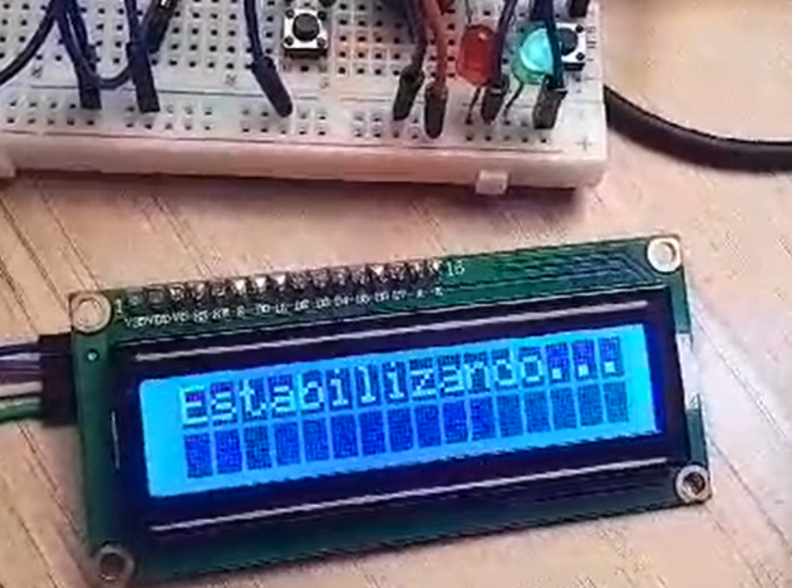 
Fonte: Material produzido pelos autores (2024)

 

- **Interface**: permite ao usuário interagir com o dispositivo, visualizando dados de sensores, monitorando o status do maquinário e controlando os atuadores. A interface exibe gráficos interativos que mostram as leituras dos sensores ao longo do tempo e oferece controles para ligar/desligar o sistema e desativar alarmes. Além disso, ela fornece informações adicionais sobre o estado operacional do maquinário, como tempo de uso, data da última manutenção e status de revisão. Esses dados são cruciais para o diagnóstico e a tomada de decisões baseadas em informações precisas e em tempo real.

 

Figura 26 - Interface 
 
Fonte: Material produzido pelos autores (2024)

 

&nbsp;&nbsp;&nbsp;&nbsp;A fim de representar as interações entre os diferentes componentes do sistema, tem-se o diagrama de sequência, um tipo de diagrama da linguagem UML (Unified Modeling Language). Ele representa a interação entre diferentes componentes de um sistema em um fluxo temporal, demonstrando como os objetos (atores e sistemas) se comunicam entre si por meio de mensagens, organizando essas trocas de forma cronológica. Cada elemento tem uma linha de vida (lifeline) que representa sua existência durante a execução do processo, e as mensagens entre os elementos são ilustradas como setas. É amplamente usado em engenharia de software para descrever o comportamento dinâmico de sistemas, especialmente no contexto de sistemas distribuídos ou orientados a eventos.
 

Figura 27 - Diagrama UML 
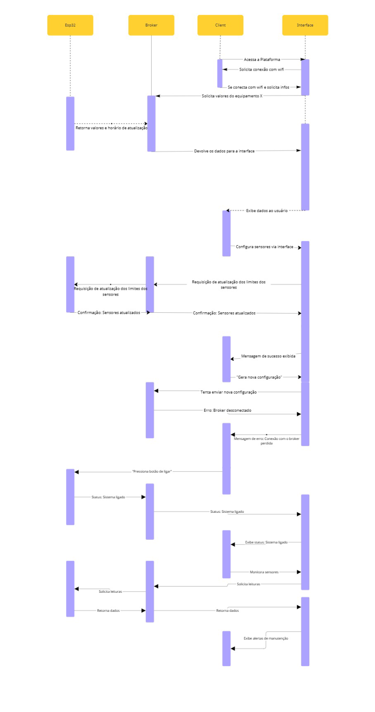 
Fonte: Material produzido pelos autores (2024)

 

&nbsp;&nbsp;&nbsp;&nbsp;O diagrama de sequência é útil porque ajuda a visualizar e compreender as interações entre os componentes do sistema ao longo do tempo, facilitando a identificação de fluxos, dependências e potenciais problemas. Ele é uma ferramenta poderosa para documentar requisitos funcionais e alinhar equipes de desenvolvimento, garantindo que todos tenham uma visão clara do comportamento esperado do sistema. Além disso, esse tipo de diagrama auxilia na validação de cenários, no planejamento de testes e na comunicação com partes interessadas técnicas e não técnicas. Por fim, ele promove uma melhor organização no desenvolvimento de software, reduzindo ambiguidades e melhorando a manutenção do sistema ao longo do tempo.

### 3.4.5 Considerações Finais 

&nbsp;&nbsp;&nbsp;&nbsp;A implementação do projeto alcançou resultados significativos, demonstrando a viabilidade técnica e a aplicabilidade prática da solução desenvolvida. Desde os protótipos iniciais, que validaram os conceitos fundamentais, até o modelo físico integrado ao protocolo MQTT, cada etapa permitiu aprimorar funcionalidades e atender aos requisitos específicos de monitoramento e controle.

Figura 28 - Protótipo Final 
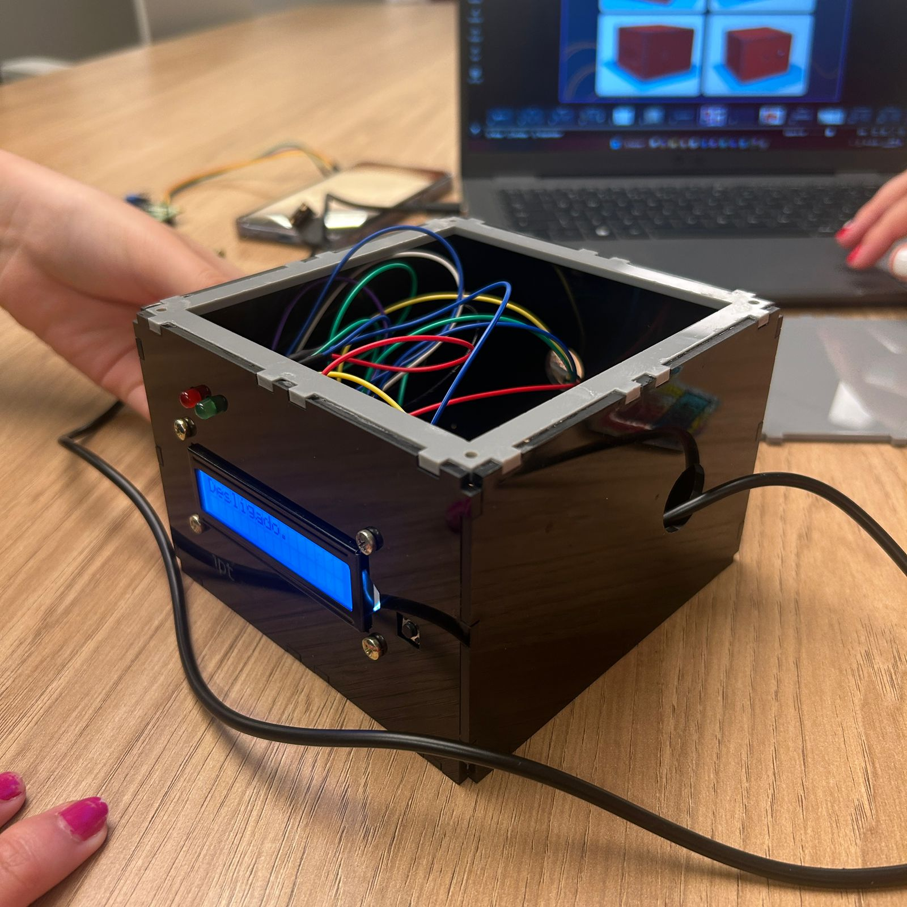 
Fonte: Material produzido pelos autores (2024)

 

 

&nbsp;&nbsp;&nbsp;&nbsp;O protótipo final consolidou a robustez do sistema, unindo sensores confiáveis, comunicação eficiente e uma interface intuitiva. Essa combinação assegura não apenas a coleta precisa de dados em tempo real, mas também a capacidade de gerar alertas e exibir informações detalhadas que facilitam a tomada de decisão.

&nbsp;&nbsp;&nbsp;&nbsp;Os testes realizados, tanto em cenários previstos quanto em situações de falha simuladas, validaram a eficácia da solução e identificaram oportunidades de refinamento. Esses aprendizados serão essenciais para futuras iterações e adaptações do sistema a diferentes contextos de uso.

&nbsp;&nbsp;&nbsp;&nbsp;Com base nesses avanços, a solução desenvolvida apresenta-se como uma contribuição relevante para o monitoramento automatizado em ambientes industriais, oferecendo maior segurança e eficiência operacional. Os próximos passos incluem a customização do sistema para demandas específicas e a ampliação de sua aplicação em novos cenários.

## 4. Conclusões e Recomendações

### 4.1. Principais Resultados

O projeto alcançou seu objetivo de desenvolver um sistema eficiente e de baixo custo para o monitoramento automatizado de equipamentos de laboratório. Foram implementados sensores de **temperatura**, **vibração** e **distância**, integrados a um **ESP32** e conectados via protocolo **MQTT**. A solução permite a coleta em tempo real dos dados ambientais e operacionais, facilitando o monitoramento contínuo e a manutenção preditiva dos equipamentos.

Entre os principais resultados obtidos estão:
- Monitoramento preciso de temperatura, possibilitando a identificação de condições ambientais inadequadas.
- Detecção de vibrações excessivas no maquinário, permitindo a identificação de problemas mecânicos.
- Publicação e armazenamento de dados em tópicos MQTT, garantindo a comunicação eficiente entre sensores e interface.
- Interface intuitiva para visualização e acompanhamento dos dados em tempo real.

O sistema se mostrou eficaz durante os testes, atendendo aos requisitos de monitoramento e contribuindo diretamente para o gerenciamento eficiente dos equipamentos.

### 4.2. Recomendações ao Parceiro

Para garantir o uso ideal da solução e ampliar os benefícios obtidos, recomenda-se:

1. **Integração com sistemas existentes**: Incorporar a solução a sistemas de gestão já utilizados pelo laboratório, centralizando os dados coletados para análise e tomada de decisão.
2. **Capacitação técnica**: Promover treinamentos para a equipe responsável pelo uso e manutenção do sistema, garantindo sua operação adequada e eficiente.
3. **Manutenção periódica**: Verificar regularmente a calibração dos sensores e a integridade física do protótipo para manter a precisão dos dados coletados.
4. **Validação em ambiente operacional**: Realizar testes em um ambiente com carga de trabalho constante para validar a robustez do sistema em condições reais.

### 4.3. Potenciais Melhorias

Além das recomendações, algumas melhorias futuras podem ser implementadas:

- **Melhoria no sistema de segurança de dados**: Implementar criptografia e autenticação para garantir a proteção das informações coletadas e transmitidas pelo sistema.
- **Adição de um sistema de login no website**: Criar uma interface com controle de acesso, permitindo que somente usuários autorizados visualizem e gerenciem os dados.
- **Integração de novos sensores ou equipamentos**: Expandir o protótipo com sensores adicionais, como pressão, gases ou luminosidade, para ampliar as possibilidades de monitoramento.
- **Refinamento da case do dispositivo**: Melhorar a estrutura física do protótipo, tornando-o mais resistente, ergonômico e adaptável a diferentes ambientes laboratoriais.

### 4.4. Materiais Extras

Para facilitar a utilização e manutenção do sistema, foi desenvolvido um vídeo de demonstração detalhado, que pode ser encontrado no README no qual todas as funcionalidades do protótipo são apresentadas de forma clara e organizada. Além disso, o código utilizado para o projeto está devidamente documentado e disponível, permitindo futuras modificações ou expansões conforme necessário.

## 5. Referências

1.	TERUCHKIN, S. R. U. As estratégias empresariais para os vinhos finos no Brasil e no Uruguai: uma análise comparada. Porto Alegre: FEE (Fundação de Economia e Estatística), n. 7. Tese (Doutorado) - UFRGS, Escola de Administração, 2003.
2.	REIS, Samuel Elias Boroni. Tecnologias aplicadas na Indústria 4.0: avanços na indústria automobilística, metalúrgica e mineral. 2024. Monografia (Graduação em Engenharia de Controle e Automação) — Universidade Federal de Ouro Preto, Escola de Minas, Ouro Preto, 2024.
3.	COOPER, A. The inmates are running the asylum. [s.l.]: Sams, 1999.
4.	COOPERSYSTEM. Requisitos funcionais e não funcionais: o que são e diferenças? Disponível em: https://www.coopersystem.com.br/requisitos-funcionais-e-nao-funcionais-o-que-sao-e-qual-e-a-diferenca/. Acesso em: 16 out. 2024.
5.	BOAG, P. All you need to know about customer journey mapping. Smashing Magazine, 15 jan. 2015.
6.	MARTIN, B.; HANINGTON, B. Universal Methods of Design. Beverly: Rockport Publishers, 2012.
7.	Disponível em: https://rockcontent.com/br/blog/5-forcas-de-porter/. Acesso em: 16 out. 2024.
8.	Disponível em: https://www.dwih-saopaulo.org/pt/pesquisa-e-inovacao/cenario-de-pesquisa-e-inovacao-no-brasil/instituicoes-de-pesquisa-e-inovacao/. Acesso em: 16 out. 2024.
9.	Disponível em: https://www.embrapa.br/sobre-a-embrapa. Acesso em: 16 out. 2024.
10.	Disponível em: https://www.nngroup.com/articles/storyboards-visualize-ideas/. Acesso em: 29 out. 2024.
11.	ISO/IEC 25010:2011. Systems and Software Engineering — Systems and Software Quality Requirements and Evaluation (SQuaRE) — System and Software Quality Models. International Organization for Standardization, 2011.
12.	MQTT. MQTT Version 5.0 Specification. Disponível em: https://mqtt.org/mqtt-specification/. Acesso em: 19 dez. 2024.
13.	ESPRESSIF. ESP32 Series Datasheet. Disponível em: https://www.espressif.com/en/products/socs/esp32. Acesso em: 19 dez. 2024.
14.	HC-SR04. Ultrasonic Sensor HC-SR04 Documentation. Disponível em: https://www.micropik.com/PDF/HCSR04.pdf. Acesso em: 19 dez. 2024.
15.	BME280. BME280 Combined Humidity and Pressure Sensor Datasheet. Bosch Sensortec, 2018. Disponível em: https://www.bosch-sensortec.com/products/environmental-sensors/humidity-sensors-bme280/. Acesso em: 19 dez. 2024.
16.	HAN, J.; KAMBER, M.; PEI, J. Data Mining: Concepts and Techniques. 3rd ed. Elsevier, 2011.
17.	TANENBAUM, A. S.; WETHERALL, D. J. Computer Networks. 5th ed. Pearson, 2010.
18.	KUBLER, S.; BOURGEOIS, J.; GRIMONPREZ, G.; MATERN, F. IoT Frameworks for Smart Environments: A Literature Review. Sensors, v. 19, n. 22, p. 4851, 2019.
19.	BRASIL. Lei nº 13.709, de 14 de agosto de 2018. Dispõe sobre a proteção de dados pessoais e altera a Lei nº 12.965, de 23 de abril de 2014 (Marco Civil da Internet). Diário Oficial [da] República Federativa do Brasil: seção 1, Brasília, DF, 15 ago. 2018. Disponível em: https://www.planalto.gov.br/ccivil_03/_ato2015-2018/2018/lei/L13709.htm. Acesso em: 19 dez. 2024.
